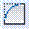

# Сопряжение

Команда **Сопряжение** позволяет сопрягать пересекающие отрезки дугой заданного радиуса.

Для того, чтобы сопрячь отрезки выполните следующие действия:

1. Выберите элемент меню **Редактировать – Сопряжение** или кнопку  на панели инструментов, либо введите `fillet` в командную строку.
2. Программа предложит указать первый отрезок, либо воспользоваться опциями команды (об этих опциях подробнее будет описано ниже). Введите в командную строку слово Радиус.
3. Задайте радиус сопряжения объектов.
4. Укажите левой кнопкой мыши первый объект.
5. Укажите второй объект.

В результате, программа построит требуемую дугу сопряжения, либо сообщит о том, что сопряжение с данным радиусом невозможно.

**Опции команды Сопряжение:**

* Опция **Полилиния** позволяет строить дуги сопряжения во всех вершинах полилинии.
* Опция **Радиус** позволяет задавать значение радиуса сопряжения элементов.
* Опция **Несколько** позволяет в цикле выполнять многократное сопряжение.

**Применимость команды:** Команда **Сопряжение** применима для редактирования элементов чертежа.
