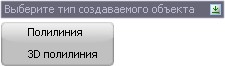

# Преобразовать линейный объект

Данная функция позволяет отрисовать линейный объект (структурная линия, трасса и пр.) полилинией или 3D полилинией. Для этого:

1. Выберите меню **Редактировать – Преобразовать линейный объект**.
2. Укажите исходный линейный объект и нажмите ПКМ, далее выберите тип создаваемой полилинии:

   

В результате линейный объект отрисуется полилинией или 3D полилинией.
