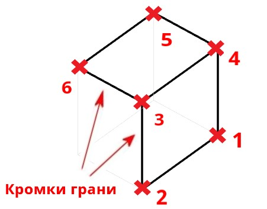
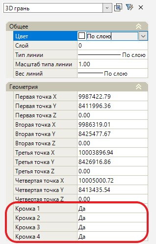

# Создание 3D Грани

**3D грань** – это примитив, с помощью которого можно построить объект из граней, ограниченных четырьмя ребрами (кромками). Каждая точка такой грани имеет три координаты *X,Y,Z*.

Для создания 3D грани:

1. Выберите меню **Рисовать – 3D грань**.
2. Укажите первую точку, а затем последующие вторую, третью и четвертую точки создаваемой грани. Последняя кромка грани будет создана автоматически, путем соединения первой и четвертой указанных точек.
3. Чтобы присоединить следующую грань укажите точки *5* и *6*. Кромка между точками *6* и *3* будет создана автоматически.
4. Для завершения ввода нажмите ПКМ или **Enter**.

В результате созданная 3D грань отобразится в рабочем окне.



Для управления видимостью каждой кромки 3D грани откройте окно **Свойства** и выберите необходимый пункт:

При необходимости скрыть кромку выберите «*Нет*», для отображения видимости кромки выберите «*Да*».


