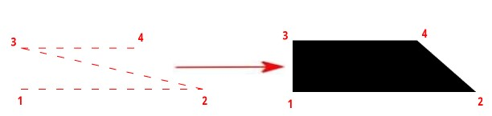

# Создание фигуры

Данная функция предназначена для построения фигур с однородной заливкой.

Пример построения фигуры четырехугольник:

1. Выберите меню **Рисовать – Фигура**.

2. Нажатием ЛКМ определите первую и вторую точку четырехугольника, третью точку необходимо указать по диагонали напротив второй точки, затем укажите четвертую точку. Построится четырехугольник с заливкой:

   

3. Курсор будет перемещаться с привязкой в 4 точке, для включения новых фигур в состав четырехугольника, укажите следующие пары точек 3 и 4. Для завершения построения фигуры нажмите ПКМ или Enter.

В результате по заданным точкам построится фигура, каждая точка которой имеет три координаты X,Y,Z.
