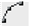
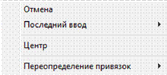
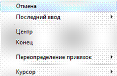
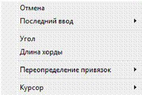
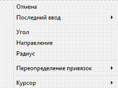

# Создание дуги

**Дуга** – это примитив являющийся частью окружности и создание ее происходит по аналогичным принципам.

Для создания дуги:

1. Выберите элемент меню **Рисовать – Дуга – По трем точкам** или кнопку  на панели **Рисовать**, либо введите `arc` в командную строку.
2. Укажите последовательно левой кнопкой мыши три точки образующие контур дуги.

После выполнения **п. 1**, также возможны альтернативные варианты построения дуги. Нажмите правую кнопку мыши, откроется контекстное меню:

   

   * Выберите элемент меню **Отменить** для выхода из режима ввода дуги.
   * Выберите элемент меню **Последний ввод** для отображения списка последних вызываемых операций.
   * Выберите элемент меню **Центр**. Далее последовательно укажите левой кнопкой мыши положение центра дуги, начальную точку дуги и конечную точку дуги. Для построения окружности данным способом также можно воспользоваться элементом меню **Рисовать-Дуга-Центр, начало, конец**.
   * Выберите элемент меню **Переопределение привязок** для однократного изменения текущих привязок.

Если после ввода дуги по трем точкам, после указания первой точки щелкнуть правой кнопкой мыши, то откроется контекстное меню:

   

   * Выберите элемент меню **Центр**. Укажите левой кнопкой мыши положение центра дуги. Далее укажите конечную точку дуги, либо нажмите правую кнопку мыши. Откроется контекстное меню, в котором можно выбрать альтернативные варианты задания конечной точки дуги:
   
     

   * Выберите элемент меню **Угол**. В появившемся поле динамического ввода задайте значение центрального угла дуги. Для подтверждения ввода щелкните правой кнопкой мыши.
   * Выберите элемент меню **Длина хорды**. В появившемся поле динамического ввода задайте длину хорды создаваемой дуги. Для подтверждения ввода щелкните правой кнопкой мыши.

После ввода дуги по трем точкам и указания первой точки, щелкните правой кнопкой мыши и из появившегося контекстного меню выберите пункт **Конец**.

Укажите левой кнопкой мыши положение конечной точки дуги. Далее укажите положение ее центра, либо нажмите правую кнопку мыши. Откроется контекстное меню, в котором можно выбрать альтернативные варианты задания центральной точки дуги:

   

   * Выберите элемент меню **Угол**. В появившемся поле динамического ввода задайте значение центрального угла дуги.
   * Выберите элемент меню **Направление**. Левой кнопкой мыши укажите направление касательной в начальной точке, либо в поле динамического ввода введите значение угла между касательной и осью X.
   * Выберите элемент меню **Радиус**. В появившемся поле динамического ввода задайте величину радиуса дуги.



 Все вышеописанные варианты построения дуг могут также выбираться из основного меню программы (**Рисовать-Дуга**).


