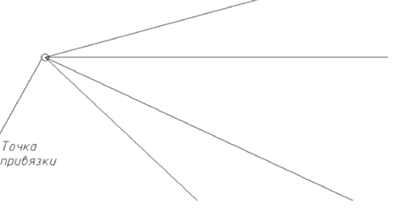

# Создание луча

В отличие от отрезка, который имеет две конечные точки, луч ограничен только с одной стороны, базовой точкой (точкой привязки луча), относительно которой он откладывается.

Для ввода луча выполните следующую последовательность действий:

1. Выберите элемент меню **Рисовать – Луч** или кнопку  на панели **Рисовать**, либо введите `ray` в командную строку.
2. Укажите в рабочей области при помощи курсора точку привязки луча, щелкнув в соответствующем месте левой кнопкой мыши.
3. Перемещая курсор, выберите направление луча. Для фиксации направления луча нажмите левую кнопку мыши.
4. Для выхода из режима ввода нажмите **ESC**.
