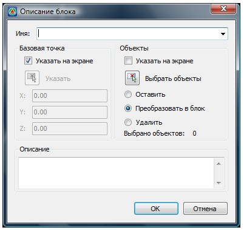

# Создание блока

**Блок** – это объединение нескольких произвольных примитивов в группу и сохраненных под определенным именем. Блок является единым объектом, не смотря на количество исходных элементов, которые его составляют.

Для создания блока:

1. Выберите элемент меню **Рисовать – Блок – Создать блок** или кнопку  на панели **Рисовать**, либо введите `block` в командную строку. Откроется диалоговое окно:

   

2. В поле **Имя** введите название создаваемого блока.

3. Выделите объект (группу объектов) для преобразования его в блок. Выделение объекта происходит следующим образом:

- Укажите базовую точку вставки. Это можно сделать различными вариантами:

   * Воспользуйтесь кнопкой **Указать**  и укажите ее местоположение в графическом поле, щелкнув для подтверждения левой кнопкой мыши.
   * Если установить опцию **Указать на экране**, то после закрытия данного диалогового окна **базовая точка** будет отдельно запрашиваться программой. По умолчанию базовой точкой любого блока является точка с координатами 0, 0, 0. Поэтому если базовая точка не будет указана при создании блока, в качестве нее будет использоваться начало координат.
   * Координаты базовой точки можно задать в соответствующих полях X,Y,Z данного диалогового окна.

- Выберите объекты, которые войдут в состав блока. Объекты могут быть выбраны при помощи команды **Выбрать объекты**  .Если же поставить опцию **Указать на экране**, то после закрытия окна Выбор объекта они будут отдельно запрошены программой. При этом необходимо указать, что должно происходить с исходными примитивами, из которых будет состоять блок. Возможны следующие варианты:
   
   * **Оставить**. Исходные объекты остаются в исходном состоянии.
   * **Преобразовать в блок.** Исходные объекты будут преобразованы в блок (станут единым объектом).
   * **Удалить**. Исходные объекты будут удалены после создания блока.
   
4. Введите при необходимости описание блока.

5. Для выхода из данного диалогового окна нажмите **ОК**.
