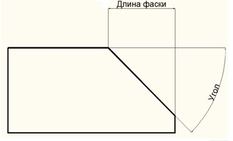

# Создание фаски

Команда Фаска выполняет операцию подрезки двух пересекающихся прямолинейных объектов (отрезок, луч, и пр.), на заданных расстояниях от точки их пересечения, строя при этом отрезок соединяющий их новые конечные точки. Имеется два способа создания фаски:

* Через длину (общий случай).
* Через угол и длину:

  

  *Рис.1. Фаска 1-ого и 2-ого отрезка заданной длиной*

Для создания фаски по длине:

1. Выберите элемент меню **Редактировать – Фаска** или кнопку  на панели инструментов, либо введите `chamfer` в командную строку.
2. Программа предложит указать первый отрезок, либо воспользоваться опциями команды (об этих опциях будет описано ниже). Введите в командную строку слово **Длина**.
3. Последовательно задайте значение длины фаски первого и второго элемента.
4. Выберите последовательно первый и второй элемент.

В результате, программа выполнит операцию подрезки двух пересекающихся объектов.

Для создания фаски по углу и длине:

1. Выберите элемент меню **Редактировать – Фаска** или кнопку  на панели инструментов, либо введите `chamfer` в командную строку.
2. Программа предложит указать первый отрезок, либо воспользоваться опциями команды ( эти опции будут описаны ниже). Введите в командную строку слово **Угол**.
3. Укажите значение длины первой фаски.
4. Укажите угол фаски с первым отрезком.
5. Выберите последовательно первый и второй редактируемый объект.

В результате, программа выполнит операцию подрезки двух пересекающихся объектов, по углу и расстоянию.

Опции команды **Фаска**:

* Опция **Полилиния** позволяет строить фаски вдоль всей полилинии. Пересекающиеся сегменты полилинии соединяются фаской в каждой ее вершине.
* Опция **Длина** позволяет задавать длину фасок.
* Опция **Угол** позволяет задавать в качестве параметров фаски одну из длин и величину угла.
* Опция **Несколько** позволяет в цикле выполнять многократную подрезку пересекающихся прямолинейных объектов. Для выхода из данного режима нажмите **Enter**.

**Применимость команды:** Команда **Фаска** применима только для редактирования элементов чертежа
