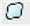
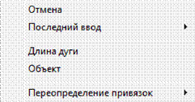

# Создание облака

Данная функция позволяет создавать специальную полилинию в форме облака. Для этого:

1. Выберите элемент меню **Рисовать – Облако** или кнопку  на панели **Рисовать**, либо введите команду `Revcloud` в командную строку.
2. Последовательно левой кнопкой мыши задайте положение контура облака.
3. Для подтверждения ввода щелкните правой кнопкой мыши.

Если в процессе создания облака, перед вводом первой точки щелкнуть правой кнопкой мыши появится контекстное меню:

* Выберите элемент меню **Отменить** для выхода из режима ввода облака.
* Выберите элемент меню **Последний ввод** для отображения списка последних вызываемых операций.
* Выберите элемент меню **Длина дуги** для задания минимальной величины длины дугового сегмента облака.
* Выберите элемент меню **Объект** для придания формы облака выбранному примитиву. После чего щелкните по нему левой кнопкой мыши.
