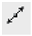

# Создание прямой

Примитив **Прямая** так же, как и **Луч** имеет точку привязки, но в отличие от луча этой точкой является середина прямой.

  

Для создания прямой:

1. Выберите элемент меню **Рисовать – Прямая** или кнопку  на панели **Рисовать**, либо введите `xline` в командную строку.
2. Укажите в рабочей области середину прямой, щелкнув в необходимом месте рабочего поля левой кнопкой мыши.
3. Перемещая курсор, выберите направление прямой. Для фиксации направления щелкните левой кнопкой мыши.
4. Для выхода из режима построения и подтверждения ввода нажмите **Enter**.

   После выполнения **п. 1**, также возможны альтернативные варианты построения прямой.

   Перед вводом первой точки (середины прямой) нажмите правую кнопку мыши.    Откроется контекстное меню:

   

   * Выберите элемент меню **Отмена** для выхода из режима ввода прямой.
   * Выберите элемент меню **Последний ввод** для отображения списка последних вызываемых операций.
   * При выборе элемента меню **Горизонтальная** задается горизонтальное положение прямой (происходит горизонтальное отображение прямой).
   * При выборе элемента меню **Вертикальная** задается вертикальное положение прямой.
   * При выборе элемента меню **Угол** задается угол наклона прямой относительно горизонтальной оси.
   * При выборе элемента меню **Биссектриса** происходит построения прямой, являющейся биссектрисой угла. Для этого необходимо указать точку вершины угла, точку определяющую направление первой стороны угла и точку на второй стороне угла.
   * При выборе элемента меню **Отступ** задается величина смещения для построения прямых линий, параллельных предварительно отрисованным отрезкам, лучам и другим прямолинейным примитивам.
