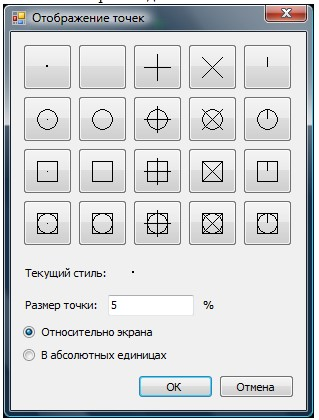

# Создание точек

Данная команда используется для построения ситуационных точек, как одиночных, так и группы.

Для создания одиночной точки:

1. Выберите элемент меню **Рисовать – Точка – Одиночная**, либо введите `point` в командную строку.
2. Укажите левой кнопкой мыши ее положение.



 Для изменения стиля отображения точки необходимо воспользоваться элементом меню **Формат – Отображение точки**. Откроется диалоговое окно:
 
 
 
 В данном окне можно менять форму точки, а также задать размеры символа точки, которые могут задаваться:

* В процентах от размера экрана, если включена опция **Относительно экрана**.
* В абсолютных единицах, если включена опция в абсолютных единицах.



**Для построения нескольких точек**:

1. Выберите элемент меню **Рисовать – Точка – Несколько** или кнопку на панели **Рисовать**.
2. Укажите левой кнопкой мыши необходимое количество точек на экране, после чего нажмите **ESC** или щелкните для подтверждения правой кнопкой мыши.

Данный блок функций содержит также несколько команд, при помощи которых можно разбивать разные фигуры на части. Такими командами являются **Поделить** и **Разметить**.

Команда **Поделить** разделяет отрезок (или другой линейный примитив) на равные части.

Для этого:

1. Выберите элемент меню **Рисовать – Точка – Поделить**, либо введите команду `divide` в командную строку.
2. Левой кнопкой мыши укажите объект для деления (полилиния, дуга и т.д.).
3. В поле динамического ввода укажите число сегментов, на которые должен быть разбит выбранный примитив.
4. В результате, выделенный объект будет разделен на требуемое количество равных частей, а на концах элементов будут дополнительно расставлены узловые точки.

**Для того чтобы расставить точки с заданным шагом вдоль примитива**:

1. Выберите элемент меню **Рисовать – Точка – Разметить**, либо введите `measure` в командную строку.
2. Левой кнопкой мыши укажите объект, который будет являться направляющим.
3. В поле динамического ввода укажите длину сегмента (шаг расстановки точек) и щелкните для подтверждения правой кнопкой мыши.

В результате, программа расставит точки вдоль примитива, с заданным шагом.
