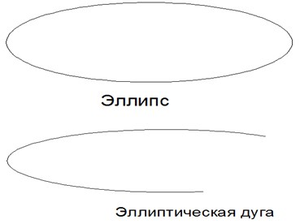
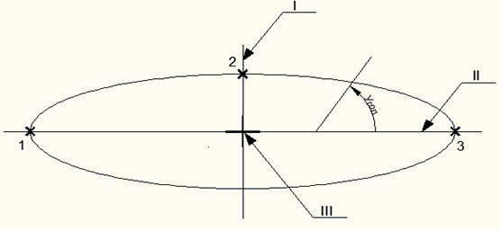
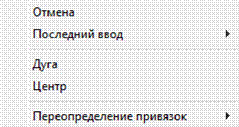

# Создание эллипса

Данная функция позволяет вычерчивать эллипсы и эллиптические дуги.

Исходными параметрами для создания эллипса являются: положение центра, направление и размер его осей (большой и малой). Схематически данные параметры фигуры показаны ниже:

*На рис.2 представлено: I – малая ось, II – большая ось, III – центр эллипса, точка 1 и точка 3 определяют местоположение и длину первой оси, точка2 определяет расстояние между центром эллипса и конечной точки второй оси.*

Для создания эллипса:

1. Выберите элемент меню **Рисовать – Эллипс – Ось**, конец или кнопку  на панели **Рисовать**, либо введите `ellipse` в командную строку.
2. Укажите левой кнопкой мыши три точки являющиеся концами осей эллипса и определяющих его направление и положение центра.

После выполнения **п. 1**, также возможны альтернативные варианты построения эллипса. Нажмите правую кнопку мыши, откроется контекстное меню:

* Выберите элемент меню **Отменить** для выхода из режима ввода эллипса.
* Выберите элемент меню **Последний ввод** для отображения списка последних вызываемых операций.
* Выберите элемент меню **Центр**. Последовательно укажите левой кнопкой мыши положение его центра, а затем, две точки являющиеся концами осей эллипса и определяющих его направление. Для построения эллипса данным способом также можно воспользоваться элементом меню **Рисование-Эллипс-По центру**.
* Выберите элемент меню **Дуга** для построения эллиптической дуги. Необходимо будет последовательно указать в строке динамического ввода конечную точку оси эллипса, вторую конечную точку той же оси. Далее указать длину другой оси. В поле динамического ввода задать начальный угол, а затем конечный угол элептической дуги, относительно первой оси. Для построения эллиптической дуги данным способом также можно воспользоваться элементом меню **Рисование - Эллипс - Эллиптическая дуга**.
