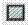
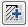
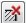

# Создание штриховки

Штриховкой являются ассоциативные блоки, как правило, используемые для наглядного отображения различных материалов, заливки контуров и т.п. Ассоциативность данного объекта связана с исходным контуром, на основе которого он создавался. Т.е. при изменении формы исходного контура будет динамически меняться форма штриховки.

Для создания штриховки:

1. Выберите элемент меню **Рисовать – Штриховка** или кнопку  на панели **Рисовать**, либо введите `Hatch` в командную строку. Откроется диалоговое окно:

   

Диалоговое окно **Штриховка** имеет набор полей для задания ее параметров.

В поле **Тип** необходимо выбрать один из следующих вариантов:

* **Стандартный** - из раскрывающийся списка Образец можно выбрать необходимый вариант штриховки.
* **Из линий** - в данном случае выбор стандартных образцов штриховок будет не доступен,а активным становится поле **Угол** и **Масштаб**. Штриховка строится с использованием набора линий, путем задания их угла наклона и интервала между ними. В поле **Угол** задается значение угла наклона линий штриховки, в градусах, к горизонтальной оси.

В поле **Масштаб** задается масштабный коэффициент штриховки относительно ее исходного размера. При увеличении масштаба штриховки соответственно увеличивается расстояние между линиями, а при уменьшении – уменьшается. В поле **Интервал** задается расстояние между линиями штриховки, в единицах чертежа. Если установлена опция **Крест – Накрест**, то сначала область штрихуется обычным образом, а затем повторяет основной образец, но уже под наклоном 90 градусов к исходному варианту.



Если в раскрывающемся списке **Тип** задана группа **Стандартный**, то поле **Интервал** и опция **Крест-Накрест** будут недоступны.



 Поле **Исходная точка штриховки** предназначена для задания базовой точки, с которой начинается ее вычерчивание. Возможны различные варианты ее задания:

- **Использовать текущую исходную точку** - при установлении данной опции в качестве начальной будет использоваться точка, заданная переменной (по умолчанию это точка с координатами 0,0).

- Опция **Указанная исходная точка,** позволяет задавать начальную точку самостоятельно. Для этого нажмите на кнопку  , чтобы задать новую точку. После нажатия становится активным поле чертежа. Щелчком левой кнопки мыши укажите положение базовой точки шаблона штриховки.

  - При установлении опции **По умолчанию до контура** становится активным раскрывающийся список, в котором необходимо выбрать расположение исходной точки относительно контура заштриховываемого объекта: вверху, внизу, слева, справа или по центру.

  - При установлении опции **Исходная точка по умолчанию**, измененные параметры будут использоваться в качестве настроек по умолчанию. Они будут применяться ко всем создаваемым штриховкам.

В поле **Контуры** выбирается объект или группа объектов образующие область штриховки.

- Кнопка **Добавить: выбрать объекты**  позволяет отметить объекты, образующие между собой заполняемую штриховкой область. После нажатия данной кнопки последовательно укажите исходные объекты левой кнопкой мыши. Для подтверждения выбора щелкните правой кнопкой мыши. В диалоговом окне **Штриховка** нажмите **ОК**.

- Кнопка **Исключение островков**  дает возможность при создании штриховки исключить отдельные ее внутренние области. Исключающие островки задаются аналогично образующим объектам.
