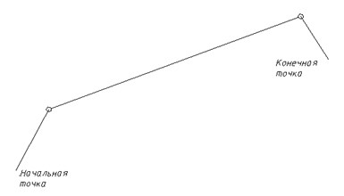
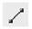

# Создание отрезка

Для ввода отрезка выполните следующую последовательность действий:

1. Выберите элемент меню **Рисовать – Отрезок** или кнопку  на панели **Рисовать**, либо введите `line` в командную строку.
2. Укажите в рабочей области при помощи курсора начальную точку отрезка, щелкнув в соответствующем месте левой кнопкой мыши.
3. Перемещая курсор за конечную точку отрезка, выберите его направление и длину. Для ввода конечной точки нажмите левую кнопку мыши.
4. Для выхода из режима ввода нажмите **ESC**.