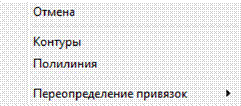
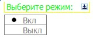
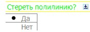

# Создание маскировки

Данный объект позволяет создавать область на экране, которая делает невидимыми ранее нарисованные примитивы, внутри ее границ. Эти области могут быть показаны как с видимыми границами.

Для создания маскировки:

1. Выберите элемент меню **Рисовать – Маскировка**, либо введите `wipeout` в командную строку.
2. Левой кнопкой мыши последовательно укажите область маскировки.
3. Для подтверждения ввода щелкните правой кнопкой и выберите из появившегося контекстного меню пункт **Замкнуть**.

Если в процессе создания маскировки, перед вводом первой точки щелкнуть правой кнопкой мыши появится контекстное меню:

* Выберите элемент меню **Отменить** для выхода из режима ввода маскировки.
* Выберите элемент меню **Контуры** для настройки отображения границ области маскировки. Выдается запрос, в котором необходимо выключить, либо включить режим отображения контуров:

  

* Выберите пункт меню **Полилиния** для выбора левой кнопкой мыши замкнутой полилинии, которая определяет область маскировки. Далее выдается следующий запрос, в котором программа предлагает стереть или оставить исходную полилинию:

  

Если выбрать пункт **Да**, то линия которая была использована для создания маскировки будет удалена. Если же выбрать пункт **Нет**, то полилиния останется.
