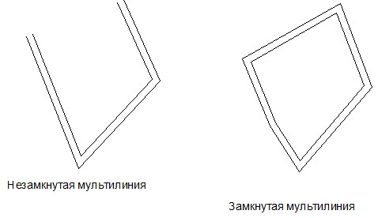

# Создание мультилиний

**Мультилиния** - это примитив, состоящий из группы параллельных друг другу полилиний. Они создаются автоматически, в процессе построения мультилиний.

Для создания мультилинии:

1. Выберите элемент меню **Рисовать – Мультилиния** или кнопку  на панели **Рисовать**, либо введите `mline` в командную строку.

2. Укажите в рабочей области первую точку, нажав левую кнопку мыши.

3. Последовательно укажите левой кнопкой мыши остальные вершины и конечную точку мультилинии.

4. После выполнения **п.1**, можно задать определенные настройки отображения мультилинии. Для этого щелкните правой кнопкой мыши, появится контекстное меню:

   

   * Выберите элемент меню **Отменить** для выхода из режима ввода мультилинии.
   * Выберите элемент меню **Последний ввод** для отображения списка последних вызываемых операций.
   * При выборе элемента меню **Расположение**, дополнительно указывается, с какой стороны от базовой линии будут рисоваться смещения. Они могут быть нарисованы: вверху, в центре (симметрично), внизу от базового элемента.
   * Элемент меню **Масштаб** определяет общую ширину мультилинии.
   * При выборе элемента меню **Стиль** можно менять имя текущего стиля.

     

     Стиль мультилиний может создаваться с помощью специального редактора (элемент меню **Формат-Стиль мультилиний**).

     

   При указании нескольких точек в контекстном меню появятся дополнительные опции: **Отменить последний ввод** и **Замкнуть**.

   * Выберите элемент меню **Отменить** последний ввод для отмены построения последнего введенного сегмента мультилинии.
   * Выберите элемент меню **Замкнуть** для автоматического соединения начальной и конечной точки мультилинии (данная опция появляется в меню при вводе четвертой точки).

     

5. Для выхода из режима построения и подтверждения ввода нажмите **Enter**.
