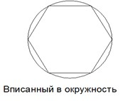
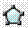

# Создание многоугольника

**Многоугольник** - это примитив, представляющий собой замкнутый контур с ребрами равной длины.

Построения многоугольников может производиться следующими способами:

* **По длине одной стороны и положению**.
* **По центру многоугольника и вписанной окружности:**

   

* **По центру многоугольника и описанной вокруг окружности:**

   

Рассмотрим более подробно данные методы построений.

Для создания прямоугольника по длине одной стороны и положению:

1. Выберите элемент меню **Рисовать – Многоугольник** или кнопку  на панели **Рисовать**, либо введите `polygon` в командную строку.
2. Укажите количество сторон многоугольника в динамической строке ввода и щелкните для подтверждения правой кнопкой мыши.
3. Нажмите правую кнопку мыши, откроется контекстное меню:

   

   * Элемент меню **Отменить** может использоваться для выхода из режима ввода многоугольника.
   * Пункт **Последний ввод** используется для отображения списка последних вызываемых операций.
   * Пункт **Сторона** необходим для построения многоугольника по длине одной стороны и ее положению.
   * Выберите элемент меню **Переопределение привязок** для однократного изменения текущих привязок.

4. Из данного контекстного меню выберите пункт **Сторона**.
5. Укажите левой кнопкой мыши положение начальной и конечной точки одной из сторон многоугольника. После чего, будет автоматически создан его контур.

Для создания многоугольника по центру и вписанной или описанной окружности:

1. Выберите элемент меню **Рисовать – Многоугольник** или кнопку  на панели **Рисовать**, либо введите `polygon` командную строку.
2. Укажите количество сторон многоугольника в динамической строке ввода и щелкните для подтверждения правой кнопкой мыши.
3. Укажите левой кнопкой мыши положение центра многоугольника. Появится следующие меню выбора:

   

4. Выберите из появившегося списка, способ по которому будет осуществляться построение многоугольника (**Вписанный в окружность** или **Описанный вокруг окружности**).
5. В поле динамического ввода задайте радиус окружности и щелкните для подтверждения правой кнопкой мыши.
6. Нажмите **Enter.**
