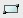
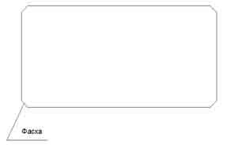
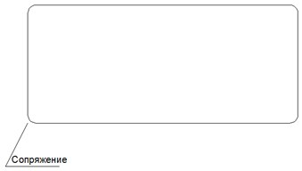

# Создание прямоугольника

Данная функция позволяет нарисовать замкнутую полилинию, образующую произвольно расположенный прямоугольник.

Для этого:

1. Выберите элемент меню **Рисовать – Прямоугольник или кнопку**  на панели **Рисовать**, либо введите `rectang` в командную строку.
2. Укажите первый угол прямоугольника, щелкнув левой кнопкой мыши в произвольном месте графического поля.
3. Укажите левой кнопкой мыши второй (диагонально противоположный) угол прямоугольника.
4. Для выхода из режима построения и подтверждения ввода нажмите **Enter**.

После выполнения **п. 1**, также возможны альтернативные варианты построения прямоугольника:

 а) Перед построением нажмите правую кнопку мыши. Откроется контекстное меню:
   
  
   
   * Выберите элемент меню **Отменить** для выхода из режима ввода прямоугольника.
   * Выберите элемент меню **Последний ввод** для отображения списка последних вызываемых операций.
   * Выберите элемент меню **Фаска** для построения прямоугольника со “срезанными” углами. Необходимо последовательно в строке динамического ввода ввести значения высоты и ширины фаски. Для подтверждения вводимых значений в строке динамического ввода, щелкните правой кнопкой мыши. После создания прямоугольника, его углы будут отрисовываться с заданной настройкой:
   
     

   * Выберите элемент меню **Сопряжение** для построения прямоугольника со скругленными углами. Аналогично, в строке динамического ввода необходимо ввести радиус сопряжения сторон прямоугольника:
   
     

   * При выборе элемента меню **Ширина**, можно аналогично задать значение толщины контура, которая будет применяться для всех вновь создаваемых прямоугольников:
   
     

   * Выберите элемент меню **Переопределение привязок** для однократного изменения текущих привязок.

б) Перед вводом второго угла нажмите правую кнопку мыши. Откроется контекстное меню:

   

   * Выберите элемент меню **Площадь** для задания площади прямоугольника. В поле динамического ввода введите значения площади и щелкните правой кнопкой мыши. После чего из выпадающего списка необходимо будет выбрать вводимый параметр – **Длина** или **Ширина**. Длина прямоугольника это размер вдоль оси X, а ширина вдоль оси Y. Второй параметр подбирается автоматически, из расчета получения требуемой площади фигуры.
   * Выберите элемент меню **Размеры** для построения прямоугольника через задание его длины и ширины. В поле динамического ввода последовательно укажите длину, а затем ширину прямоугольника.
   * Выберите элемент меню **Поворот** для задания угла поворота нижней стороны прямоугольника относительно оси X. Угол поворота может задаваться визуально левой кнопкой мыши или в строке динамического ввода. После этого, визуально укажите положение второго, диагонально-противоположного угла прямоугольника.
