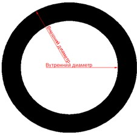

# Создание кольца

Данная команда позволяет строить закрашенную область образованную двумя окружностями, у которых диаметры различны, а положение центров совпадает.

Для создания кольца:

1. Выберите элемент меню **Рисовать – Кольцо** или кнопку  на панели **Рисовать**, либо введите `donut` в командную строку.
2. Введите в поле динамического ввода значение внутреннего диаметра кольца.
3. Введите в поле динамического ввода значение внешнего диаметра кольца.
4. Укажите левой кнопкой мыши положение центра кольца. Для выхода из данного режима ввода нажмите **Enter**.
