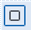

# Создание подобных объектов

Команда **Подобие** предназначена для рисования параллельных линий. Она применима к линейным и площадным объектам: отрезки, лучи, полилинии, прямые, дуги, окружности, многоугольники, эллипсы и сплайны. Для построения параллельных линий возможны два варианта: по расстоянию смещения и через заданную точку.

Для создания подобного объекта по смещению:

1. Выберите элемент меню **Редактировать – Подобие** или кнопку  на панели инструментов, либо введите `offset` в командную строку.
2. В поле динамического ввода введите величину смещения, либо задайте ее визуально левой кнопкой мыши, указав две точки в рабочей области.
3. Укажите левой кнопкой мыши объект, от которого нужно построить параллельную линию.
4. Укажите левой кнопкой мыши точку, определяющую сторону смещения.
5. Для выхода из текущей команды нажмите **Enter** или щелкните правой кнопкой мыши.

Для создания подобного объекта через заданную точку:

1. Выберите элемент меню **Редактировать – Подобие** или кнопку  на панели инструментов, либо введите `offset` в командную строку.
2. Щелкните правой кнопкой мыши и из появившегося контекстного меню выберите опцию **Через**.
3. Выберите объект, от которого нужно построить параллельную линию.
4. Укажите левой кнопкой мыши точку, через которую пройдет создаваемая линия. Величина смещения рассчитывается автоматически.
5. Для выхода из текущей команды нажмите **Enter** или щелкните правой кнопкой мыши.

**Применимость команды:** Команда **Подобие** применима для редактирования чертежей и объектов **ЦММ**.
