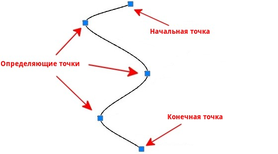
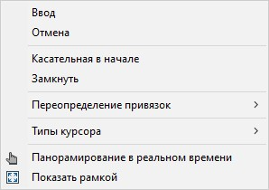

# Создание сплайна

**Сплайн** – это примитив, состоящий из точек (начальная, конечная и определяющие), соединенных плавной кривой.

Для создания сплайна:

1.Выберите меню **Рисовать – Сплайн**.

2.В рабочем окне нажатием ЛКМ укажите первую точку сплайна, далее последовательно укажите остальные точки.

3.Для выхода из процесса ввода нажмите 2 раза **Enter** или нажмите ПКМ, откроется контекстное меню:

   * Для подтверждения ввода сплайна выберите пункт **Ввод**, курсор переместится в начальную точку сплайна, для выхода из процесса ввода нажмите ПКМ или **Enter**.

   * Для отмены ввода сплайна нажмите **Отмена**.

   * Для изменения направления касательной в начальной точке сплайна выберите пункт **Касательная в начале**. Для перехода в конечную точку сплайна и изменения в ней направления касательной нажмите ЛКМ.

   * При необходимости замкнуть сплайн выберите пункт **Замкнуть**. В этом случае совпадают конечная и начальная точки сплайна, а так же направления касательных в них.

4. Выберите необходимый пункт и нажмите **Enter**.

В результате введенный сплайн отобразится в рабочем окне.



Для изменения направления точек сплайна, с помощью курсора мыши, потяните за грипы сплайна в нужную сторону.


