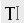
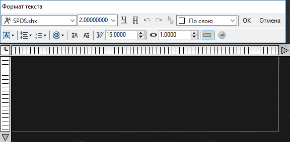
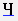
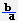
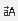
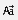

# Создание текста

Данный блок функций позволяет создавать надписи различной сложности (однострочный, многострочный текст). Для создания текста имеются две команды **Однострочный** и **Многострочный**. Тексты могут иметь различные стили. Для редактирования стилей используется команда **Текстовый стиль**, которая вызывается из элемента меню **Формат**.

**Для ввода однострочного текста:**

1. Выберите элемент меню **Рисовать – Текст – Однострочный текст** или кнопку  на панели **Рисовать**, либо введите `text` в командную строку.
2. Укажите на экране левой кнопкой мыши базовую точку текста.
3. Введите в строке динамического ввода значение высоты текста и щелкните для подтверждения правой кнопкой мыши.
4. Введите в строке динамического ввода значение угла поворота текста относительно горизонтальной оси и щелкните для подтверждения правой кнопкой мыши.
5. Введите текст. Для завершения нажмите кнопку **Enter**.

Для формирования и редактирования больших текстовых надписей или абзацев удобно использовать многострочный текст. Т.к. его создание происходит в специальном графическом редакторе.

**Для создания многострочного текста:**

1. Выберите элемент меню **Рисовать – Текст – Многострочный текст** или кнопку на панели **Рисовать**, либо введите команду `mtext` в командную строку.
2. Левой кнопкой мыши укажите первый угол предполагаемой области, в которой будет вводиться текст.
3. Укажите противоположный угол предполагаемой области, в которой будет вводиться текст. Появится окно **Формат** текста:

   

   Данное окно обладает набором функций для редактирования текстовых надписей:
   * **Текст** - при помощи раскрывающегося списка можно менять стиль текста.
   * **Высота текста** - в данном поле можно менять высоту вводимого текста.
   * **Подчеркнутый** - при нажатии кнопки  Подчеркивание, текст подчеркивается линией (снизу).
   * **Надчеркнутый** - При нажатии кнопки  Надчеркивание, происходит надчеркивание текста линией (сверху).
   * **Дробный** - при нажатии кнопки  текст преобразуется в дробь. Для этого, редактируемый текст обязательно должен содержать символ деления **/**.
   * **Цвет** - данная опция позволяет менять цвет текста.
   * **Выравнивание многострочного текста** - из выпадающего списка можно выбрать вариант выравнивания многострочного текста. К примеру, вверх по центру, середина по центру, вниз влево.
   * **Межстрочный интервал** - увеличение (изменение) межстрочного интервала текста.
   * **Вертикальное выравнивание** - текст может быть выровнен по центру, вверх, вниз.
   * **Символ** - в данном списке содержится ряд специальных символов, которые могут вставляться в текст. К примеру, градус, диаметр, и т.д..
   * **Верхний** - при нажатии кнопки  выбранная буква или цифра текста становится заглавной.
   * **Нижний** - при нажатии кнопки  выбранная буква или цифра становится строчной.
   * **Угол наклона** - задается угол наклона текста.
4. Введите в рабочей области данного окна требуемый текст.
5. Нажмите кнопку **ОК**.
