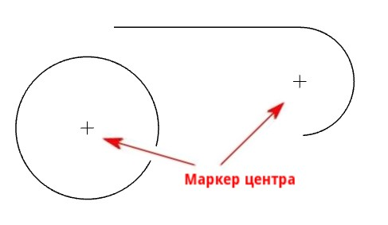
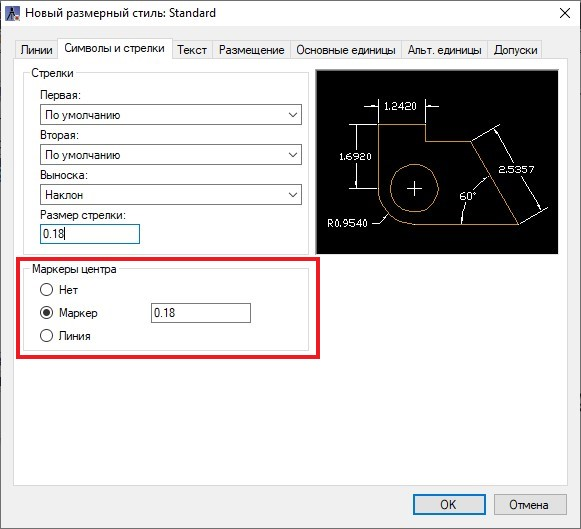

# Маркер центра

Данная функция предназначена для простановки маркера центра окружности, дуги или дугового сегмента полилинии.

Чтобы проставить маркер центра:

1. Выберите меню **Рисовать – Размеры – Выноска** или в ленте во вкладке **Построения** на панели **Размеры** нажмите пиктограмму .
2. Выберите дугу, круг или дуговой сегмента полилинии, маркер автоматически проставится в центре элемента. Для выхода из команды нажмите ПКМ или Enter.

В результате в центре выбранных элементов появится маркер.

Внешний вид и размер маркера центра можно менять в настройках размерного стиля (меню **Формат - Размерные стили**):

