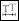
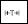
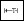

# Размерный текст

Данный инструмент позволяет менять положение размерного текста, в зависимости от выбранной функции. Для этого:

1. Выберите меню **Рисовать – Размеры – Размерный текст** – *выберите необходимую функцию*:

* **В начало** () – возвращение текста в исходную позицию, если текст предварительно был перемещен вручную (с помощью грипа).
* **Угол** () – поворот текста на заданный угол.
* **Слева** () – перемещение текста к левой выносной линии.
* **По центру** () – выравнивание текста по центру размерной линии.
* **Справа** () - перемещение текста к правой выносной линии.

2. ЛКМ укажите размер, в котором необходимо поменять местоположение текста. Для подтверждения команды нажмите ПКМ или Enter.



В случае выбора функции **Угол** укажите нужный размер, затем в динамическом вводе задайте угол поворота текста и нажмите **Enter**.



В результате размерный текст примет заданное положение.
