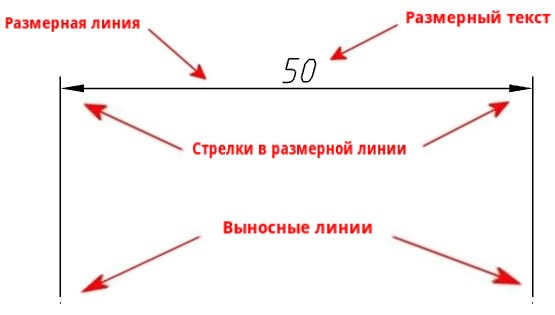
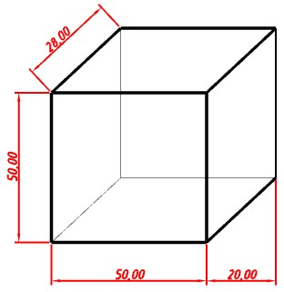
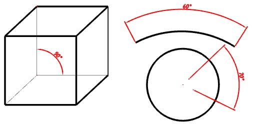
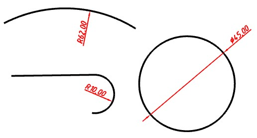
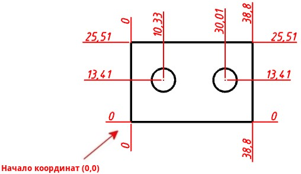
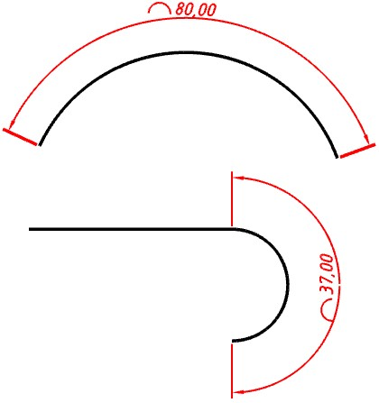
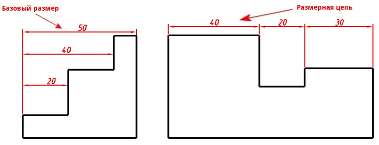
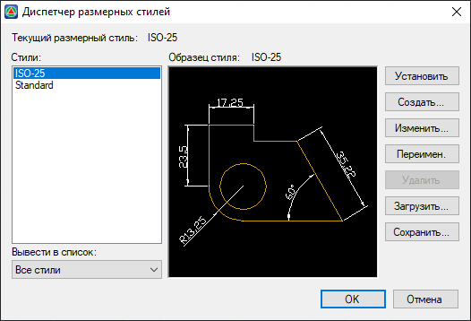

# Типы размеров

Размеры в {{robur}} это отдельные объекты, которые имеют ряд свойств.

Размеры состоят из выносных линий, размерной линии со стрелками и размерного текста:

Типы размеров делятся на *линейные, угловые, радиальные, ординатные размеры, длина дуги, базовый размер и размерные цепи*.

## Линейные размеры

Линейные размеры применяют для обозначения таких параметров, как длина, ширина, толщина, высота.

Линейные размеры могут иметь горизонтальное, вертикальное или параллельное направление.

## Угловые размеры

Угловой размер характеризует величину угла и наносится для обозначения углов между двумя непараллельными линиями (отрезок, полилиния и т.д.) или тремя точками (вершиной и двумя конечными точками).

## Радиальный размер

Радиальный размер устанавливает величину радиуса или диаметра дуги, окружности или дугового сегмента полилинии.

## Ординатный размер

Ординатный размер показывает перпендикулярную проекцию расстояния от начала (база отсчета) координат до указанной точки элемента.

## Размер длина дуги

Размер **Длина дуги** показывает расстояние вдоль дуги или дугового сегмента полилинии.

## Базовый размер и размерные цепи

**Базовый размер** это когда несколько размеров отложены от исходного размера.

**Размерные цепи** – набор линейных и радиальных размеров, у которых начало каждого размера совпадает с концом предыдущего, т.е. у каждого последующего размера выносная линия совпадает с предыдущей выносной линией.

## Размерные стили

**Размерный стиль** - группа настроек, определяющая внешний вид размеров, расположение размерного текста, и т.д.

Для работы с размерными стилями:

1. Выберите **Рисовать – Размеры – Размерные стили**, откроется окно **Диспетчер размерных стилей**:

   

* Описание работы с размерными стилями представлено в разделе [Дополнительные инструменты](../../../../install_startup/startup/working_with_layers_model/tool.md#dimensions).
