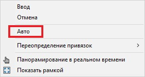

# Смещение размеров

Данная функция предназначена для корректировки расстояния между линейными, угловыми, а так же базовыми размерами и размерной цепи. Для этого:

1. Выберите меню **Рисовать – Размеры – Смещение размеров**.
2. Выберите исходный размер, относительно которого будут смещаться остальные размеры, далее выберите размеры для смещения и нажмите ПКМ.
3. В динамической строке ввода задайте значение расстояния между размерами и нажмите Enter. Для автоматического подбора расстояния смещения размеров нажмите ПКМ и из контекстного меню выберите:

   

В результате выбранные размеры будут смещены на заданное расстояние относительно исходного размера.
