# Нанесение размеров

В данном разделе описываются алгоритмы нанесения размеров.

В зависимости от выбранного типа размера функционал позволяет использовать дополнительные команды из контекстного меню.

Ниже представлено контекстное меню с общими командами для *линейных, угловых, радиальных, ординатных размеров и размера длины дуги*:

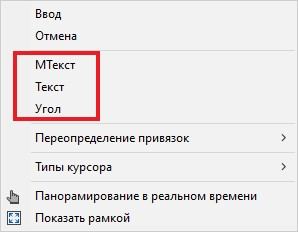  

**МТекст** – данная команда позволяет редактировать текст размера и добавлять новый многострочный текст.

**Текст** - данная команда позволяет редактировать текст размера и добавлять новый однострочный текст.

**Угол** – данная команда изменяет угол поворота текста размера.  

## Нанесение линейных размеров

К линейным размерам относят **Линейный размер** (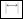), **Параллельный размер** (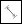).

Для нанесения линейных размеров:

1. Выберите меню **Рисовать – Размеры** – *выберите необходимый размер* или в ленте во вкладке **Построения** на панели **Размеры** нажмите соответствующую пиктограмму.

2. ЛКМ укажите начало первой, а затем второй выносной линии.

   

   Для быстрого нанесения размера всего объекта нажмите ПКМ и выберите нужный объект.  

    Чтобы задать направление **Линейному размеру** нажмите ПКМ, откроется контекстное меню, выберите необходимое направление:

    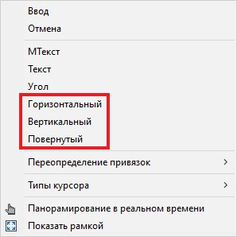

   

3. С помощью курсора мыши укажите положение размерной линии и нажмите ЛКМ.

## Нанесение углового размера

Для нанесения углового размера:

1. Выберите меню **Рисовать – Размеры – Угловой размер** или в ленте во вкладке **Построения** на панели **Размеры** нажмите пиктограмму .

2. Курсор примет форму прицела, выберите способ для нанесения размера:

   * При нанесении углового размера *на две непараллельные линии* угол будет определяться по двум крайним точкам указанных линий. Для этого укажите первую, а затем вторую линию.

   * При нанесении углового размера *дуги* угол будет определяться с помощью центра и концов дуги.

   * При нанесении углового размера *окружности* указывается первая конечная точка, а затем вторая конечная точка угла, центр окружности будет использоваться в качестве вершины угла.

   * Чтобы задать *угол по трем точкам* (вершиной и двумя конечными точками) нажмите ПКМ или Enter. Укажите точку вершины угла, а затем его две крайние точки.

    

3. Определите положение размерной дуги с помощью курсора мыши и нажмите ЛКМ.

## Нанесение радиального размера

К радиальным размерам относят **Радиус**(), **Диаметр**(), **Радиус с изломом**().

Для нанесения радиального размера:

1. Выберите меню **Рисовать – Размеры** – *выберите необходимый размер* или в ленте во вкладке **Построения** на панели **Размеры** нажмите соответствующую пиктограмму.
2. Курсор примет форму прицела, выберите дугу, круг или дуговой сегмент полилинии.
3. При выборе размера **Радиус** или **Диаметр** с помощью курсора мыши укажите положение размерной линии и нажмите ЛКМ.  

    При выборе размера **Радиус с изломом** ЛКМ укажите исходную точку размера (переопределение положения центра), затем курсором мыши определите положение размерной линии и нажмите ЛКМ. Далее двигая курсором мыши, укажите положения излома выносной линии и нажмите ЛКМ.

## Нанесение ординатного размера

Ординатные размеры состоят из значения координаты *X* или *Y* и выноски.

Для нанесения ординатного размера:

1. Выберите меню **Рисовать – Размеры – Ординатный размер** или в ленте во вкладке **Построения** на панели **Размеры** нажмите пиктограмму .

2. Укажите ЛКМ характерную точку элемента.

3. Чтобы выбрать по какой оси будет отображено значение размера, нажмите ПКМ, откроется контекстное меню, выберите необходимый пункт:

   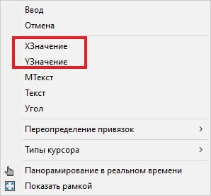  

   * Значения координаты *Х* показывают расстояние от начала координат отсчета по оси *X*.

   * Значения координаты *Y* показывают расстояние от начала координат отсчета по оси *Y*.

    

4. ЛКМ укажите конечную точку выноски размера.

## Нанесение размера длины дуги

Для нанесения размера *Длина дуги*:

1. Выберите меню **Рисовать – Размеры – Длина дуги** или в ленте во вкладке **Построения** на панели **Размеры** нажмите пиктограмму 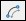.

2. ЛКМ выберите дугу или дуговой сегмент полилинии и с помощью курсора мыши определите положение размера длины дуги Зафиксируйте его нажатием ЛКМ.



Для нанесения размера участка длины дуги, после выбора дуги, нажмите ПКМ, откроется контекстное меню, из которого выберите:  

 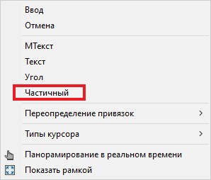

 Укажите положение первой, а затем второй точки размера длины дуги и определите положение размера.



## Нанесение базового размера и размерной цепи

Для нанесения *базового размера* или *размерной цепи*:

1. Выберите меню **Рисовать – Размеры** – *выберите необходимый размер* или в ленте во вкладке **Построения** на панели **Размеры** нажмите соответствующую пиктограмму 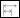 (**Базовый размер**), 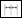 (**Размерные цепи**).

2. Курсор примет форму прицела, выберите исходный размер, от которого будет отложен следующий размер, и с помощью курсора и ЛКМ укажите начало второй и последующей выносной линии.

3. Для завершения процесса нажмите Enter. Чтобы переопределить исходный размер нажмите ПКМ и выберите из контекстного меню:

   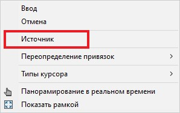

## Нанесение быстрого размера

Данная функция позволяет проставить выбранный тип размера сразу для нескольких объектов. Для этого:

1. Выберите меню **Рисовать – Размеры – Быстрый размер** или в ленте во вкладке **Построения** на панели **Размеры** нажмите пиктограмму 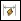.

2. Выберите объекты для нанесения размеров и нажмите ПКМ.

3. Для выбора типа размера нажмите ПКМ, откроется контекстное меню:

   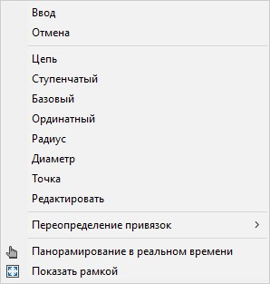

   * **Цепь** – нанесение цепочки из линейных размеров.

   * **Ступенчатый** – нанесение группы ступенчатых размеров, в которых размерные лини смещены относительно друг друга с постоянным шагом.

   * **Базовый** – нанесение группы базовых размеров.

   * **Ординатный** – нанесение группы ординатных размеров.

   * **Радиус/Диаметр** – нанесение группы радиальных размеров.

   * **Точка** – задание новой точки базы отсчета для ординатных размеров.

   * **Редактировать** – удаление или добавление выбранных местоположений точек выносных линий размера, перед созданием размеров.

4. Выберите необходимый тип размера, определите местоположение размерной линии и нажмите ЛКМ.
