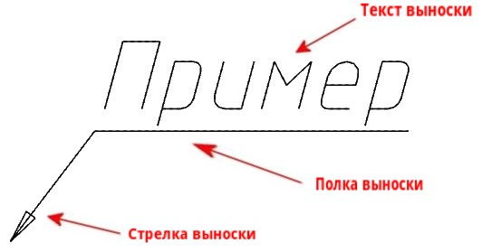

# Выноска

Данная функция предназначена для выноса сноски с введенным многострочным текстом.

1. Выберите меню **Рисовать – Размеры – Выноска** или в ленте во вкладке **Построения** на панели **Размеры** нажмите пиктограмму .

2. ЛКМ укажите местоположение точки стрелки выноски, далее укажите точку положения полки выноски, появится окно **Формат текста**:

   

* Описание работы с текстом представлено в разделе [Создание текста](../create_text.md).

4. Введите в рабочей области данного окна требуемый текст и нажмите **ОК**.

В результате в указанном месте рабочего поля отобразится выноска с заданным текстом.
