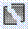

# Расчленить

Данная команда расчленяет более сложные объекты (полилинии, блоки) на более простые исходные (отрезки, дуги и т.п.).

Для того, чтобы расчленить объекты выполните следующие действия:

1. Выберите элемент меню **Редактировать – Расчленить** или кнопку  на панели инструментов, либо введите `explode` в командную строку.
2. Выделите секущей рамкой или левой кнопкой мыши объекты для редактирования.
3. Для подтверждения выбора нажмите правую кнопку. Программа расчленит объекты.

**Применимость команды** Команда **Расчленить** применима только для редактирования элементов чертежа.
