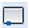

# Разрыв объектов в заданной точке

Данная команда позволяет разорвать объект в точке указанной графическим способом.

Для этого:

1. Выберите элемент меню **Редактировать – Разорвать** в точке или кнопку  на панели инструментов.
2. Выделите левой кнопкой мыши редактируемый объект.
3. Укажите точку на объекте, которая будет являться местом разрыва.

**Применимость команды:** Команда **Разорвать** в точке применима только для редактирования элементов чертежа.
