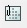
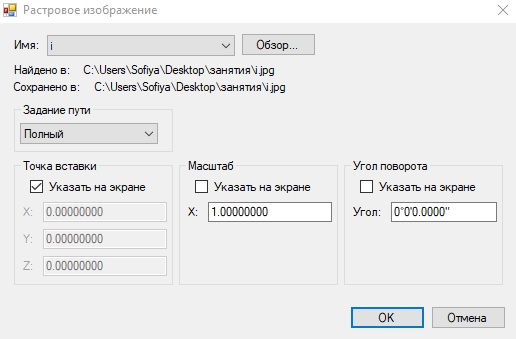

# Вставка растрового изображения

Данная команда предназначена для подгрузки в проект растровых изображений. Поддерживается большинство распространенных форматов, таких как: **bmp, jpg,tiff, png**.

Для загрузки растра выполните следующие действия:

1. Выберите элемент меню **Рисовать – Растровая подложка - Вставить растр** или кнопку  на панели **Рисовать**, либо в командной строке введите команду `imageattach`. Откроется окно **Выбор файла изображения**.

2. Укажите имя и тип файла изображения. Нажмите кнопку **Открыть**. Откроется диалоговое окно:

   

   Если растровое изображение уже было вставлено в текущую модель проекта, то его можно выбрать из раскрывающегося списка **Имя**. При отсутствии растрового изображения в списке необходимо, с помощью кнопки **Обзор** открыть окно поиска растрового файла и выбрать нужный файл в соответствующей папке. После закрытия окна поиска имя выбранного файла отобразится в списке, а путь к файлу будет указан в информационной строке **Сохранено в**.

   Также в данном окне, в поле **Задание пути**, можно задать следующие настройки:

  * **Полный** - данный путь содержит полную информацию об иерархической структуре папок, содержащие файл, на который указывает ссылка.
  * **Относительный** - путь частично определяет иерархическую структуру папок, задаваемые относительно текущего чертежа. Этот способ описания пути позволяет перенести всю структуру папок с чертежами на другой носитель информации (жесткий диск).

    

    При нахождении файла на другом жестком диске или сетевом сервере, на который есть ссылка, возможность использования относительного пути недоступна.

    

    **Правила формирования относительного пути:**

    `\` - корневая папка жесткого диска, на котором расположен чертеж.

    `путь – путь` начиная от папки, в которой находится чертеж.

    `\путь – путь`, начиная от корневой папки.

    `.\путь – путь`, начиная от папки, в которой находится текущий чертеж.

    `..\путь – путь`, начиная от папки, лежащей выше уровнем папки текущего чертежа.

    `..\..\путь – путь`, начиная от папки, лежащей двумя уровням выше папки текущего чертежа и тд.

  * **Без пути**. Данный путь вместе с внешней ссылкой не сохраняет информацию о пути. При выборе данного способа программа предпринимает поиск:

    1. Поиск текущей папки главного чертежа.
    2. Путь поиска файлов проекта, заданные в диалоговом окне **Параметры** (меню **Сервис**).
    3. Путь поиска вспомогательных файлов, заданных в диалоговом окне **Параметры**.

     

    **Точка вставки**. Базовой точкой изображения по умолчанию принимается его левый нижний угол. Если установлена опция **Указать на экране**, то положение базовой точки указывается непосредственно при вставке растра. Если данная опция не установлена, то в полях Х,Y,Z необходимо ввести соответствующие значения ее координат.

    **Масштаб**. В данном поле, при необходимости, можно задать масштабный коэффициент, на который будет увеличен или уменьшен размер исходного изображения, при вставке.

    Если в данном поле установлена опция **Указать на экране**, то масштабный коэффициент будет задаваться непосредственно при вставке растра.

    **Угол поворота**. В данном поле можно задать угол поворота вставляемого изображения относительно оси Х. Аналогично полям **Точка вставки** и **Масштаб**.

3. Для окончательной загрузки растрового изображения нажмите **OK**.



 После загруки растрового изображения, часто возникает необходимость изменить его масштаб и расположение, т.е. перенести растр в заданные координаты. Для этого можно воспользоваться функцией **Выровнять**, которая будет подробно описана [ниже](alignment_objects.md).


