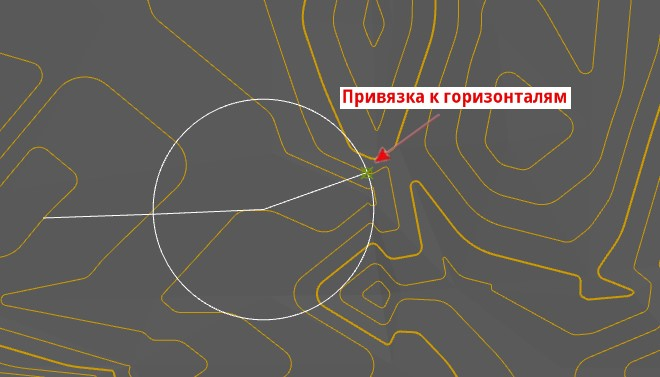

# Линия нулевых работ

Данная функция позволяет провести трассирование по поверхности (с привязкой к динамическим горизонталям с заданным шагом) или по растровым и векторным подложкам (без привязки), вдоль которого уклон поверхности земли равен руководящему уклону.

Для того чтобы отрисовать линию нулевых работ:

1. Выберите меню **Рисовать – Линия нулевых работ**.

2. В динамическом вводе задайте руководящий уклон и нажмите **Enter**, далее укажите шаг горизонталей и нажмите **Enter**.

При отрисовке линии нулевых работ между горизонталями с указанным шагом и заданным руководящим уклоном, программа автоматически определит требуемое горизонтальное проложение, которое будет откладываться между смежными горизонталями.



Задаваемый шаг горизонталей должен соответствовать установленному в настройках текущей модели *ЦММ*.



3. Привязкой к горизонталям укажите первую точку начала линии нулевых работ, программа автоматически построит окружность вокруг указанной точки, с радиусом равным рассчитанному горизонтальному проложению линии.

4. Привязкой к последующим горизонталям отрисуйте рассчитанное горизонтальное проложение. Для завершения команды нажмите ПКМ или **Enter**.

   

В результате линия нулевых работ отобразится в рабочем поле как примитив *полилиния*.
