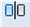

# Зеркальное отражение

Данная команда позволяет зеркально отразить выбранные объекты относительно мнимой задаваемой оси.

Для того, чтобы зеркально отобразить объекты выполните следующие действия:

1. Выберите элемент меню **Редактировать – Зеркальное отражение** или кнопку  на панели инструментов, либо введите `mirror` в командную строку.
2. Левой кнопкой мыши укажите объекты для редактирования. После выбора объектов нажмите **Enter** или щелкните правой кнопкой мыши.
3. Укажите последовательно левой кнопкой мыши первую и вторую точку линии, относительно которой необходимо построить отраженный объект.
4. Программа предложит удалить исходные объекты. Необходимо будет выбрать либо **Да**, либо **Нет**.

**Применимость команды:**

Команда **Зеркальное отражение** применима для редактирования чертежей, объектов **ЦММ** и **Трасс**.
