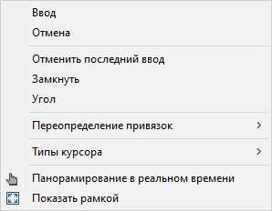
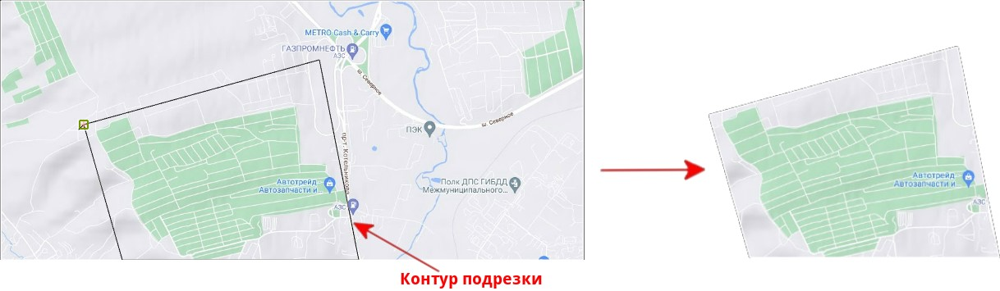
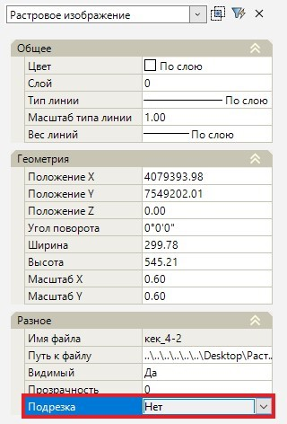

# Подрезка изображения

Данная функция предназначена для обрезки растрового изображения. Для этого:

1. Выберите меню **Редактировать – Подрезка изображения**.
2. Нажатием ЛКМ выберите растровое изображение и выделите контуром те части изображения, которые необходимо оставить видимыми.
3. Нажмите ПКМ и из контекстного меню выберите необходимый пункт:

   

* **Ввод** – подтверждение и завершение команды. Контур автоматически замкнется путем соединения конечной и начальной точки контура.
* **Отмена** - выход и отмена команды.
* **Отменить последний ввод** – отменяет ввод последнего введенного сегмента контура.
* **Замкнуть** – данная команда позволяет замкнуть вводимый контур, соединив начало и конец контура.

В результате растровое изображение обрежется, а выделенная часть изображения останется видимой.

Для возврата растрового изображения в исходный вид, в **Свойствах** изображения, в параметре **Подрезка** выберите «*Нет*»:

