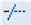

# Обрезка объектов

Данная команда позволяет производить обрезку одного объекта по заданной границе другого.

Для этого:

1. Выберите элемент меню **Редактировать – Обрезать** или кнопку  на панели инструментов, либо введите `trim` в командную строку.
2. Укажите левой кнопкой мыши пересекаемый объект. После чего нажмите правую кнопку мыши.
3. Укажите левой кнопкой мыши обрезаемый объект с той стороны от секущей границы, которая должна быть удалена.
4. Для завершения команды нажмите **Enter**.

**Применимость команды:** Команда **Обрезать** применима только для редактирования элементов чертежа (отрезки, полилинии и пр.).
