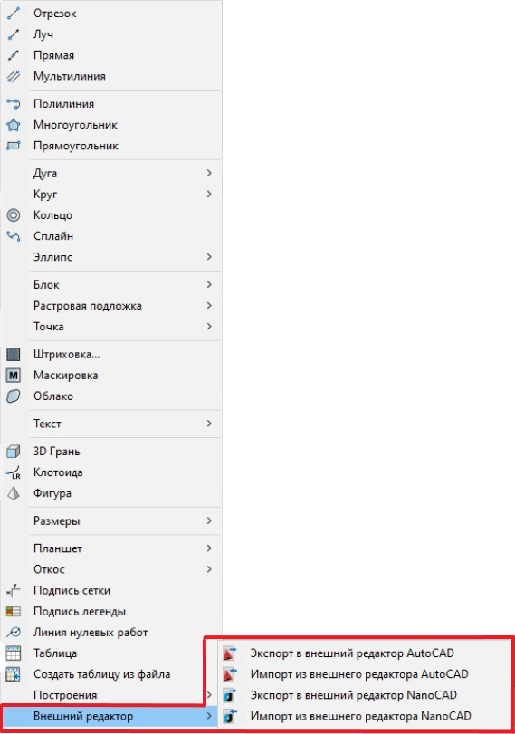

# Внешний редактор. Быстрый импорт/экспорт ситуации

{{robur}} имеет возможность осуществлять «прямой» импорт/экспорт ситуации, когда работа ведется совместно с другими графическими пакетами, например, такими как Autocad или NanoCAD.



Для работы данной функции сторонний графический редактор должен быть запущен.



Чтобы воспользоваться функционалом внешнего редактора, в {{robur}} выберите **Рисовать – Внешний редактор**:

## Импорт

Для **Импорта** из стороннего графического редактора в {{robur}}, выберите соответствующую опцию из списка **Рисовать – Внешний редактор** – развернется окно стороннего графического редактора, а указатель в нем примет форму прицела. Укажите необходимые примитивы для импорта в {{robur}} и нажмите ПКМ или Enter, чтобы завершить выполнение данной операции. Перейдите в {{robur}}, чтобы увидеть результат.

## Экспорт

**Экспорт** из {{robur}} в сторонний графический редактор выполняется аналогичным образом, путем выбора соответствующей опции из списка **Рисовать – Внешний редактор**. Только в случае экспорта примитивы необходимо выбрать в среде {{robur}} и, далее, по нажатию ПКМ или Enter, выбранные примитивы перенесутся в среду стороннего графического редактора. Перейдите в него, чтобы увидеть результат.



*Экспорт* и *импорт* примитивов осуществляется в исходных координатах.


