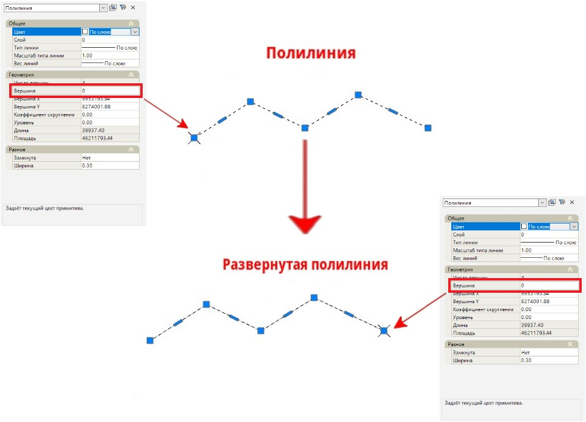

# Развернуть полилинию

Данная функция позволяет изменить направление полилинии на противоположное. Для этого:

1. Выберите меню **Редактировать – Развернуть полилинию**.
2. Выберите полилинию, которую необходимо развернуть.

В результате полилиния изменит своё направление на противоположное. Нумерация вершин полилинии поменяется местами в обратном порядке.

