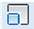
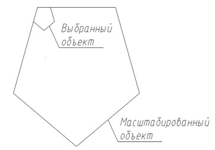

# Масштабирование

Команда **Масштабировать** позволяет увеличивать или уменьшать масштаб объекта относительно заданной точки.

Для того, чтобы задать масштаб объекта выполните следующие действия:

1. Выберите элемент меню **Редактировать – Масштабировать** или кнопку  на панели инструментов, либо введите `scale` в командную строку.
2. Выделите рамкой объекты для редактирования. После чего нажмите правую кнопку мыши, либо **Enter**.
3. Укажите левой кнопкой мыши базовую точку, относительно которой будут масштабироваться объекты.
4. Задайте масштабный коэффициент в строке динамического ввода. Для увеличения объектов нужно ввести число больше 1, а для уменьшения – положительное число меньше 1. Также, масштаб объекта можно задать графически, перемещая курсор и удерживая нажатой левую кнопку мыши.

**Дополнительные опции команды Масштабировать:**

* Опция **Масштаб** позволяет задавать масштабный коэффициент в строке динамического ввода.
* Опция **Копировать** позволяет создавать копии выбранных объектов для масштабирования:

  

- Опция **Опорный отрезок** позволяет масштабировать выбранные объекты относительно существующей и новой длины опорного отрезка. Для этого, необходимо ввести начальное значение длины, с которого изменяется масштаб выбранных объектов, а затем ввести конечное значение длины, до которого изменяется масштаб выбранных объектов. Также, длина может быть определена графически, по двум точкам.

**Применимость команды**: Команда **Масштабировать** применима для редактирования чертежей ситуации и объектов **ЦММ**.
