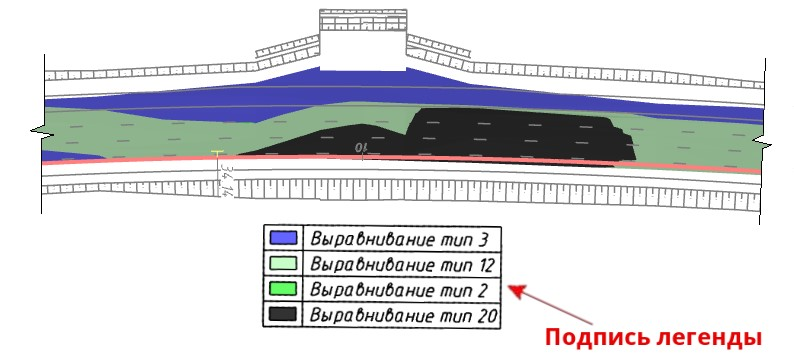

# Подпись легенды

Данная функция позволяет вставлять в текущую модель *ЦММ* список условных обозначений выраженных участков проектной поверхности. Например, когда необходимо вставить описание элементов проектной поверхности или описание картограммы выравнивания.

Для этого:

1. Выберите меню **Рисовать – Подпись легенды**.
2. Укажите точку вставки списка с описанием поверхности.

В результате в указанной точке отобразится описание поверхности в табличной форме.

*Пример вставленной подписи легенды картограммы выравнивания*:

