# Создание и настройка таблицы

Таблица представляет собой объект, состоящий из столбцов и строк, в ячейках, которых отображаются данные.

## Вставка таблицы

Данная функция позволяет вставлять в текущую модель таблицу с заданными параметрами. Для этого:

1. Выберите меню **Рисовать – Таблица**, откроется окно **Вставка таблицы**:

   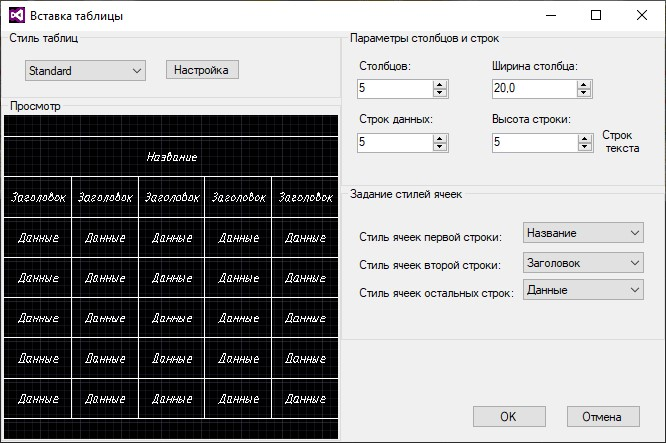

* В левой верхней части поле **Стиль таблиц** предназначено для выбора стиля таблицы, создания нового и задания его настроек. По умолчанию стиль таблиц представлен *Standart*.

   

   Описание создания стиля таблиц и его настройка представлено в подразделе [Настройка стиля таблиц](create_setting_table.html#nastrojka-stilya-tablic).

   

* В поле просмотр отображается образец таблицы с заданными настройками.

* В правой верхней части окна, в поле **Параметры столбцов и строк**, задается размер создаваемой таблицы, путем регулирования количества её столбцов и строк, а так же их ширины и высоты.

* В правой нижней части окна, в поле **Задание стилей ячеек**, устанавливается стиль ячеек первой, второй и остальных строк таблицы. Стиль таблиц *Standart* по умолчанию включает три стиля ячеек *Название, Заголовок, Данные*.

2. Задайте необходимые параметры таблицы и нажмите **ОК**.

3. С помощью ЛКМ укажите точку вставки таблицы в рабочем поле.

В результате таблица с заданными настройками отобразится в рабочем поле.

## Свойства таблицы

При выборе таблицы в левой части рабочего окна отображаются ее свойства:

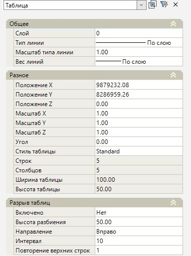

* В разделе свойств **Общее** задаются основные параметры отображение таблицы в рабочем пространстве (*Вес линии границ ячеек таблицы, Слой и т.д*.).

* В разделе свойств **Разное** указаны параметры для редактирования таблицы (*Положение таблицы относительно координат, ее масштаб, угол поворота*) и отображены ее геометрические характеристики (*количество строк, столбцов, ширина и высота таблицы и т.д.*).

* Раздел свойств **Разрыв таблиц** позволяет разделить таблицу по горизонтали на отдельные части (исходную и дополнительную).

Для этого:

1. В поле **Включено** активируйте функцию разрыва таблицы, выбрав пункт «*Да*».
2. В поле **Высота разбиения** задайте высоту разбиения для исходной и других частей таблицы.
3. В поле **Направление** задайте направление размещения дополнительной части таблицы относительно исходной: *Вправо, Влево, Вниз*.
4. В поле **Интервал** задайте расстояние между частями разбитой таблицы.
5. В поле **Построение верхних строк** задайте количество повторений верхних строк каждой части разбитой таблицы.

## Настройка стиля таблиц

Вид таблицы определяется стилем таблицы, который содержит стили ячеек.

Для создания пользовательского стиля таблицы и его редактирования:

1. Выберите меню **Рисовать – Таблица**, в открывшемся окне **Вставка таблицы** нажмите **Настройка**:

   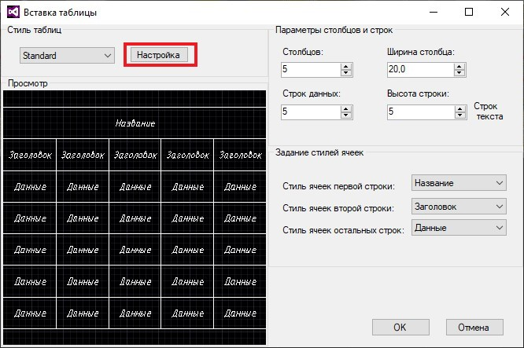

2. Откроется окно **Стили таблиц**:

   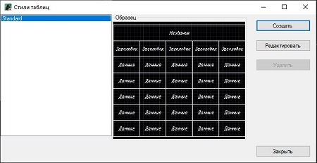

   * В левой части окна отображен список доступных стилей таблиц.

   * В поле **Образец** отображен образец таблицы с настройками выбранного стиля.

   * В правой части окна можно создать, редактировать и удалить стиль таблицы.

Чтобы создать новый стиль таблиц нажмите кнопку **Создать**, откроется окно **Создание нового стиля таблиц**:

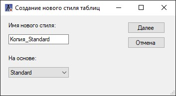

- В данном окне введите **Имя нового стиля** таблицы, далее из селектора выберите, на основе какого стиля, он будет создаваться, затем нажмите **Далее**, откроется окно **Изменение стиля таблиц**:

  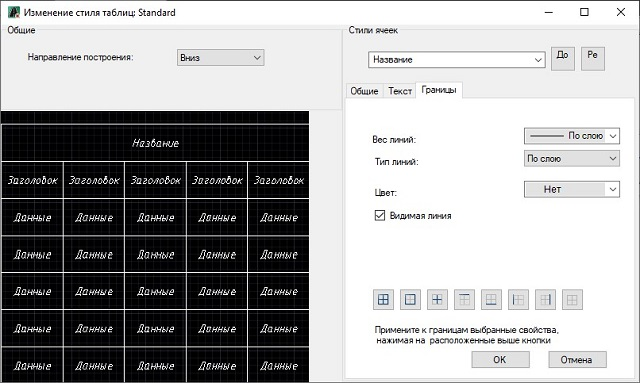

  * В поле **Общие** параметр **Направление построения** отвечает за настройку положения строк в таблице. При выборе значения *Вниз* создается таблица с направлением чтения данных сверху вниз. При выборе значения *Вверх* создается таблица с направлением чтения данных снизу вверх.

  * В левом нижнем углу отображается образец таблицы с настройками текущего стиля.

  * Поле **Стили ячеек** предназначено для задания нового стиля ячеек или редактирования существующего стиля. Выберите необходимый пункт в селекторе:

    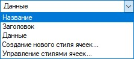

    Для редактирования существующего стиля ячеек выберите необходимый стиль ячеек.

    Чтобы создать новый стиль ячеек выберите **Создание нового стиля ячеек** или нажмите кнопку 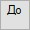 , в открывшемся окне введите имя нового стиля ячеек и выберите на основе, какого стиля ячеек, он будет создан:

    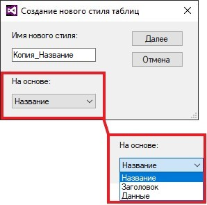

    Для управления стилями ячеек выберите соответствующий пункт или нажмите кнопку 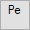, откроется окно **Управление стилями ячеек**:

    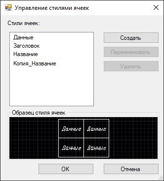

    В данном окне можно создать новый стиль ячеек, а так же переименовать и удалить созданный пользовательский стиль ячеек.

    ***Вкладки в поле "Стили ячеек"**.*

    В данных вкладках проводится настройка внешнего вида ячеек с данными, текста ячеек и их границ.

    *Вкладка Общие*

    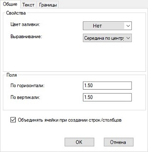

    * В поле **Свойства** задается цвет фона для ячеек и выравнивание текста в ячейках таблицы.

    * Поле **Поля** позволяют настроить отступы по вертикали и горизонтали от границ ячейки до содержимого.

    * Активная опция **Объединять ячейки при создании строк/столбцов** позволяет, при создании новой строки/столбца с применением текущего стиля ячеек, выполнять объединение ячеек этой строки/столбца в одну ячейку. С помощью этого параметра можно создать строку названия в верхней части таблицы.

    *Вкладка Текст*

    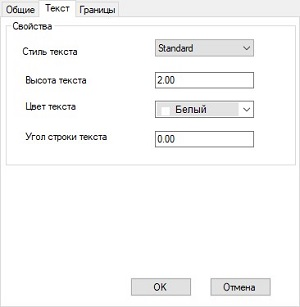  

    В данной вкладке задаются свойства текста в ячейках таблицы и угол поворота текста в ячейке.  

    *Вкладка Границы*

    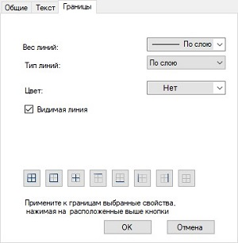  

    * В данной вкладке для начала задайте настройки границам ячеек таблицы (*Вес линии, Тип линии, Цвет*), затем используйте кнопки для выбора типа границ, к которым будут применены эти настройки.

3. Задайте все необходимые настройки стиля таблицы и нажмите **ОК**.

В результате будет создан пользовательский стиль таблицы со всеми заданными настройками.

## Создание таблицы из внешнего файла

Данная функция позволяет вставлять таблицу в рабочее окно **План** и/или рабочее окно **Чертежи** из внешнего файла форматов **\*.CSV UTF-8**, **\*.XLSX/.XLS**.



Предварительно файл должен быть добавлен в структуру проекта (см. описание [Структура проекта](../../../../install_startup/startup/structure_project/structure_project.md))



Чтобы вставить таблицу в план из внешнего файла::

1. В структуре проекта ПКМ нажмите на файл и из контекстного меню выберите **Вставить в план**:

   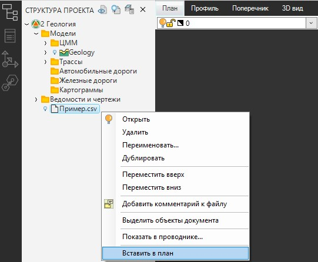

2. Откроется окно:

   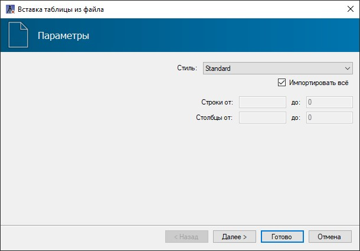

   В поле **Стиль** выберите стиль таблицы (описание настройки стилей таблицы см. раздел [Настройка стиля таблиц](create_setting_table.html#nastrojka-stilya-tablic)). При включенной опции **Импортировать всё** из внешнего файла в план вставятся все строки и столбцы. Чтобы задать диапазон импортируемых строк и столбцов, отключите данную опцию. По окончании настроек нажмите **Далее**.

3. Если внешний файл формата **\*.XLSX/\*.XLS**, то см. п. 4. Если внешний файл формата \*.**CSV UTF-8**, то откроется вкладка Параметры CSV:

   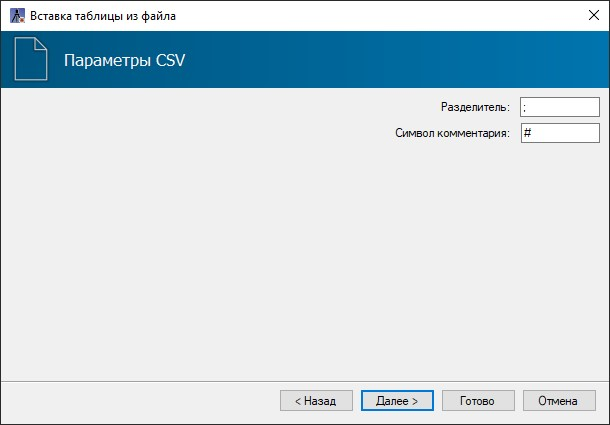

   В поле **Разделитель** задается символ, который будет являться разделителем столбцов (например, **«.»**). Этот символ предназначен для корректного распределения данных по столбцам таблицы и должен соответствовать используемому разделителю в исходном файле. При не соответствии символов все данные будут занесены в один столбец.

   В случае необходимости скрыть определенные строки таблицы при импорте файла, в исходном документе перед этими строками ставится соответствующий префикс (например, **«#»**). В поле **Символ комментария** задается условный знак соответствующий строкам описания в исходном файле.

   Для перехода на следующую вкладку нажмите **Далее**.

4. В данной вкладке представлен предварительный просмотр вставляемой таблицы со всеми текущими настройками. Далее нажмите **Готово**:

   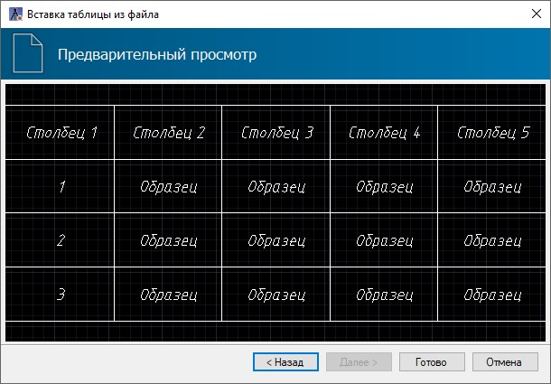

5. В рабочем поле укажите точку вставки таблицы и с помощью курсора мыши определите угол поворота таблицы или задайте угол в строке динамического ввода и нажмите Enter. Как результат таблица вставится в поле рабочего окна:

   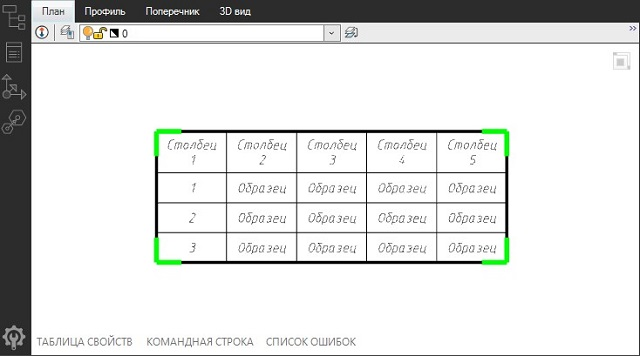

Функционал работы с таблицей см. описание [Работа с таблицей.](work_table.md)

Дополнительно редактировать таблицу можно с помощью контекстного меню. Для этого зайдите в редактор таблицы (см. описание [Работа с таблицей](work_table.md)) и нажмите ПКМ, откроется контекстное меню:

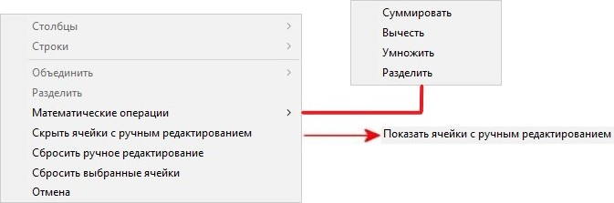

* **Математические операции** – описание работы данных функций представлено в разделе [Редактирование таблицы](work_table.md#redaktirovanie-tablicy).

* Чтобы снять подсветку границ ячеек с ручным редактированием значений выберите **Скрыть ячейки с ручным редактированием**. Чтобы отобразить подсветку границ ячеек с ручным редактированием обратно выберите пункт **Показать ячейки с ручным редактированием**.

* Чтобы во всех ячейках с ручным редактированием вернуть измененные вручную значения в исходные значения выберите **Сбросить ручное редактирование**.

* Чтобы локально в выделенных ячейках с ручным редактированием вернуть измененные вручную значения в исходные значения выберите **Сбросить выбранные ячейки**.

* **Отмена** – сброс выбранных команд из контекстного меню и выход из команды редактирование таблицы.
