# Работа с таблицей

После создания таблицы имеющийся функционал программы позволяет проводить дополнительные операции с ней, а именно управлять таблицей с помощью грипов, редактировать таблицу, экспортировать ее в Excel, а так же обновлять таблицу при изменении исходного файла.

Для этого выберите нужную таблицу и нажмите ПКМ, откроется контекстное меню, из которого выберите необходимый пункт:

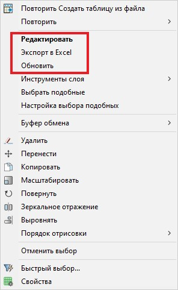

## Редактирование таблицы

Из контекстного меню выберите пункт **Редактировать**, так же данную функцию можно вызвать двойным нажатием ЛКМ на границу таблицы.

Таблица примет вид:

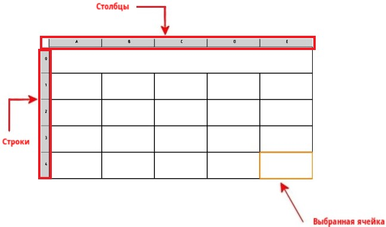

* Каждому столбцу таблицы присвоена буква (*например, A, B, C и т.д.*), а строкам – числа (*например, 0, 1, 2 и т.д.*).

* Выбранная ячейка выделяется цветом.

* Каждая ячейка может содержать однострочный текст или формулы.

* Чтобы ввести данные в таблицу, двойным нажатием ЛКМ выберите необходимую ячейку, введите в нее данные и нажмите **Enter**.

При редактировании таблицы откроется панель инструментов **Таблица**:

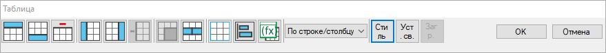

В данной панели отображены инструменты для редактирования таблицы:

*  - вставка строки сверху над выбранной ячейкой.

*  - вставка строки снизу под выбранной ячейкой.

*  - удаление строки с выбранной ячейкой.

*  - вставка столбца слева от выбранной ячейки.

*  - вставка столбца справа от выбранной ячейки.

*  - удаление столбца с выбранной ячейкой.

*  - объединение выбранных ячеек. Метод объединения ячеек выбирается из контекстного меню, при нажатии данной пиктограммы:

   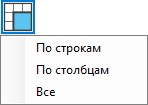

Объединение ячеек осуществляется:

*По строкам* – соединение выделенных ячеек в каждой строке отдельно.  
 *По столбцам* – соединение выделенных ячеек в каждом столбце.  
 *Все* – соединение выбранных ячеек в одну.



Для выделения нескольких ячеек удерживайте клавишу *Shift* и последовательно ЛКМ выберите необходимые ячейки, вместе с указанными ячейками будут выбраны также все ячейки, расположенные между ними.



*  - разделение объединенных групп ячеек.

*  - настройка границ ячеек. Нажатие пиктограммы вызывает открытие окна **Свойства границ ячеек**:

  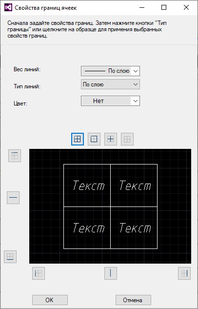  

 В данном окне задаются свойства границ ячеек (*Вес линии, Тип линии, Цвет*) и способ отображения границ таблицы (  - *Все границы*,  - *Внешние границы*,  - *Верхние границы*,  - *Нижние границы и т.д*).  

В видовом поле окна отображается образец таблицы с выбранными настройками границ.  

 *  - настройка выравнивания текста внутри ячейки. Способ выравнивания выбирается из контекстного меню, которое открывается при нажатии пиктограммы:

   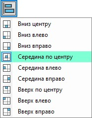

* 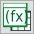 - математические операции, данная функция позволяет использовать, в ячейках таблицы, готовые формулы (*умножить, суммировать, вычесть, разделить*), определяющие значение в выбранной ячейке на основании значений, содержащихся в других ячейках таблицы. Для этого:  

   1. Выделите ячейку, в которой будет отображено рассчитанное по формуле значение.  

   2. Выберите нужную математическую операцию в раскрывающемся контекстном меню при нажатии пиктограммы:

      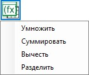  

   3. Выберите первую, а затем вторую ячейки, которые будут учувствовать в расчете.  

   В результате рассчитанное по формуле значение отобразится в выбранной на первом шаге ячейке.



При необходимости вставленную формулу можно отредактировать вручную, для этого двойным нажатием ЛКМ выберите ячейку с рассчитанным значением и отредактируйте это значение:

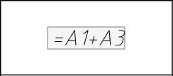

В формулах ячейки обозначаются с помощью буквы столбца и номера строки. Формула должна начинаться со знака *равенства* ( = ) и может содержать любой из следующих знаков: знак *плюс* ( + ), знак *минус* ( - ), знак *умножения* ( \* ), знак *деления* ( / ).



* 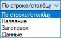 - в данном селекторе отображается выбор стиля ячеек.

* 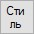 - данная пиктограмма предназначена для редактирования стиля таблицы. Подробное описание изменения стиля таблицы представлено в разделе [Создание и настройка таблицы](create_setting_table.html#nastrojka-stilya-tablic) в подразделе *Настройка стиля таблиц*.

* 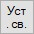 - данная функция позволяет задавать связи данных в *ячейках таблицы* с внешними данными в файле. Например, в созданную таблицу подгружать данные из внешнего файла.  

   Для этого нажмите данную пиктограмму и в открывшемся окне *Создание таблицы на основе внешних данных* задайте необходимые настройки (описание работы с данным окном представлено в разделе [Создание и настройка таблицы](create_setting_table.html#sozdanie-tablicy-iz-vneshnego-fajla) в подразделе *Создание таблицы из внешнего файла*), нажмите **ОК**.

* 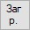 - данная функция позволяет загрузить изменения из исходного внешнего файла.  

   Так же редактирование таблицы осуществляется с помощью вызванного контекстного меню. Чтобы вызвать контекстное меню, находясь в активной команде редактировании таблицы, нажмите ПКМ, откроется контекстное меню:

  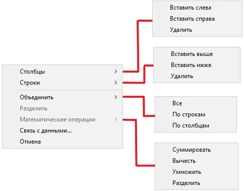

## Экспорт таблицы в Excel

Данная функция предназначена для экспортирования созданной таблицы в *Excel*. Для этого:

1. Из контекстного меню выберите пункт **Экспорт в Excel** ([*см. описание выше*.](work_table.md))

2. В появившемся контекстном меню выберите «*Да*», если необходимо открыть файл после его создания в соответствующем редакторе или «*Нет*», если в открытии файла нет необходимости:

   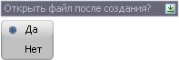

3. В открывшемся окне введите имя файла и нажмите **ОК**:

   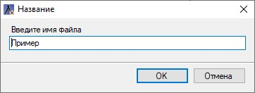

В результате экспортируемый файл будет добавлен в структуру проекта и отобразится в папке **Ведомости и чертежи** – … *в папке модели, в которой файл был создан*.

## Обновление данных таблицы

Данная функция предназначена для обновления данных таблицы при изменении данных исходной таблицы внешнего файла.

Для этого в контекстном меню выберите пункт **Обновить** ([*см. описание выше*.](work_table.md))

## Управление таблицей с помощью ручек (грипов)

Визуальное редактирование размера таблицы осуществляется с помощью ручек (грипов), которые появляются при выборе таблицы:

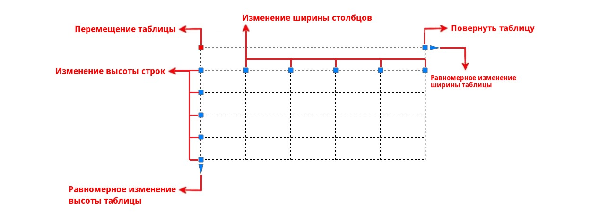

* Чтобы переместить таблицу нажмите ЛКМ соответствующий грип (*Перемещение таблицы*), он будет точкой переноса таблицы, курсором мыши определите место вставки таблицы и нажмите ЛКМ.  

   Чтобы переместить таблицу на заданное расстояние, выберите надлежащий грип, с помощью курсора мыши укажите направление перемещения таблицы и в строке динамического ввода задайте расстояние, на которое сместится таблица, для подтверждения команды нажмите **Enter**:

  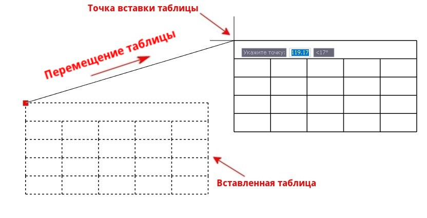

* Для равномерного растяжения размера таблицы нажмите ЛКМ соответствующий грип (*Равномерное изменение высоты таблицы или Равномерное изменение ширины таблицы*) и с помощью курсора мыши растяните таблицу в нужном направлении, затем нажмите ЛКМ.  

   При необходимости равномерного изменения размера таблицы на заданную высоту или ширину выберите надлежащий грип и в строке динамического ввода задайте необходимый размер, на который равномерно изменится таблица, нажмите **Enter**.

* Для визуального изменения ширины/ высоты столбца/ строки нажмите ЛКМ соответствующий грип (*Изменение ширины столбцов или Изменение высоты строк*) и курсором мыши потяните в нужную сторону, для завершения команды нажмите ЛКМ.  

   Для более точного изменения ширины/высоты столбца/строки выберите надлежащий грип и в строке динамического ввода задайте необходимый размер, на который будет изменена ширина/высота столбца/строки, далее нажмите **Enter**.  

   В любом из этих случаев, размер таблицы изменится в соответствии с размером редактируемой строки или столбца.

* Чтобы повернуть таблицу в нужную сторону относительно точки вставки таблицы, нажмите ЛКМ необходимый грип (*Повернуть таблицу*) и потяните в нужную сторону или задайте необходимый угол в динамической строке ввода, затем завершите команду, нажав ЛКМ.

Дополнительные команды с таблицей можно осуществлять с помощью контекстного меню. Для этого выберите таблицу, нажмите ЛКМ грип и нажмите ПКМ, откроется контекстное меню:

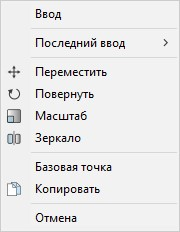

* **Переместить** – данная команда позволяет перенести таблицу в рабочем поле. В данном случае точкой переноса будет предварительно выбранный грип или назначенная базовая точка таблицы.

* **Повернуть** – данная команда предназначена для поворота таблицы вокруг базовой точки на заданный угол или визуально с помощью курсора мыши.

* **Масштаб** – данная команда позволяет увеличивать или уменьшать масштаб таблицы относительно базовой точки. Изменить масштаб можно с помощью введения масштабного коэффициента в строку динамического ввода или графически с помощью курсора мыши.

* **Зеркало** – данная команда позволяет зеркально отразить таблицу относительно условно задаваемой оси.

* **Базовая точка** – с помощью данной команды назначается базовая точка таблицы относительно, которой будут производиться команды с таблицей.

* **Копировать** – данная команда предназначена для создания копий таблицы.

* **Отмена** – данный пункт меню предназначен для завершения работы выбранной команды.
