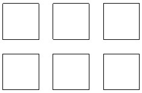
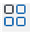
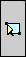
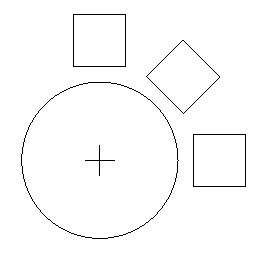
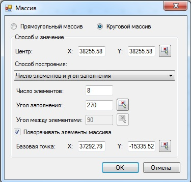

# Работа с массивами

Команда **Массив** предназначена для создания множества копий одних и тех же объектов. Массив может быть прямоугольной и круговой формы:

## Прямоугольный массив

Для создания прямоугольного массива:

1. Выберите элемент меню **Редактировать – Массив** или кнопку  на панели инструментов, либо введите `array` в командную строку.

2. Выделите левой кнопкой мыши объекты для создания массива. После чего нажмите правую кнопку мыши, либо **Enter**.

3. Откроется окно **Создание массива**, в котором установите опцию **Прямоугольный массив**:

   

4. Заполните группу полей **Расстояние** и **Направление**. Такие параметры, как **Число рядов** и **столбцов**, **Расстояние между рядами** и **столбцами**, **Угол поворота** - однозначно определяют количество и расположение объектов массива.

   

   Расстояние между рядами и столбцами, а также угол наклона массива можно задавать при помощи мыши. Для задания данных параметров визуально, нажмите кнопку , расположенную напротив соответствующего поля. После чего на экране укажите левой кнопкой мыши две точки, которые и зададут соответствующие значение. Если щелкнуть по кнопке  , то указав левой кнопкой мыши две точки на экране можно сразу задать расстояние между рядами и столбцами. Если расстояние положительно, то объекты располагаются вправо по оси X и вверх по оси Y. Отрицательное значение меняет направление расположения по соответствующей оси.

   

 5. Нажмите **OK**.

## Круговой массив

Для создания кругового массива:

1. Выберите элемент меню **Редактировать – Массив** или кнопку  на панели инструментов, либо введите `array` в командную строку.

2. Выделите левой кнопкой мыши объекты для создания массива. После чего нажмите правую кнопку мыши, либо **Enter**.

3. Откроется окно **Создание массива**, в котором установите опцию **Круговой массив**. В окне автоматически появятся параметры **Кругового массива**:

   

4. Заполните группу полей **Способ** и **Значение**:

   * Задайте координаты (X и Y) центра кругового массива.
   * Выберите из раскрывающегося списка способ построения массива: **Число элементов и угол заполнения, Число элементов и угол между элементами, Угол заполнения и угол между элементами**.
   * В зависимости от выбора способа построения, заполните следующие параметры:

       - **Число элементов**. Данный параметр определяет общее число копируемых элементов, которые будут помещены в заданный сектор массива.
       - **Угол заполнения**. Задает размер кругового сектора, который будет заполнен массивом.
       - **Угол между элементами**. Задает расстояние в градусах между двумя соседними элементами кругового массива. В этом случае угол заполнения рассчитывается автоматически. Положительное значение определяет направление заполнения против часовой стрелки, а отрицательное – по часовой.
    * Опция **Поворачивать элементы массива** определяет, будут ли объекты поворачиваться параллельно касательным к дуге окружности при их копировании или нет.
    * **Базовая точка**. Эта точка, которая остается на постоянном расстоянии от центральной точки при построении массива. Введите в соответствующие поля координаты X, Y базовой точки объекта. Для задания координат графически, нажмите кнопку  , расположенную напротив соответствующего поля.

5. Нажмите **OK**.

**Применимость команды**: Команда **Массив** применима для редактирования чертежей и объектов **ЦММ**.
