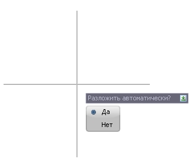
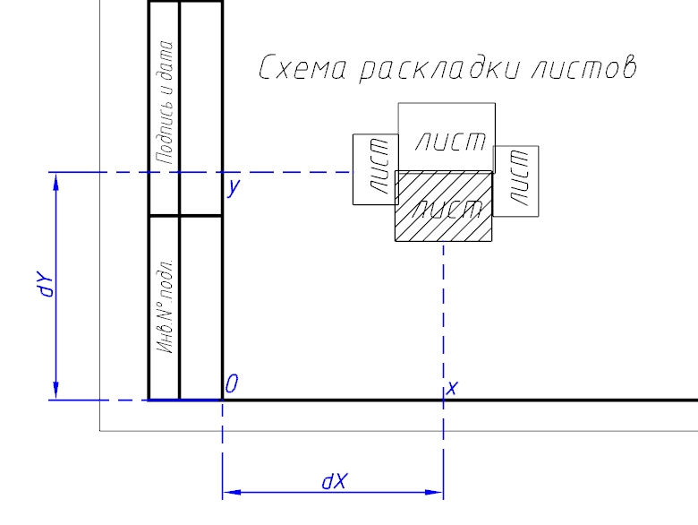

# Схема раскладки листов

Данная функция позволяет отрисовать схему раскладки листов в качестве примитива блока с изображением линейного объекта вдоль которого производилась раскладка и пронумерованными листами.

Для этого:

1. Выберите меню **Рисовать - Планшет - Схема раскладки**, курсор примет форму прицела, выберите группу листов, подтвердив выбор правой кнопкой мыши (или клавишей **Enter**):

   

2. Укажите место вставки **Схемы раскладки** на листе.
3. Выберите **Да**, если требуется вставить схему раскладки на всех выбранных листах:

   

4. В результате, **Схема раскладки** будет отрисована автоматически на всех выбранных листах. Схема раскладки на остальных листах отрисуется в той же точке вставки которая была указана на первом листе (шаг. 2):

   



В случае внесения каких либо изменений в раскладку листов, например изменение количества листов, формата или положения, необходимо функцию отрисовки схемы раскладки выбрать еще раз, предварительно удалив ранее отрисованные данные.


