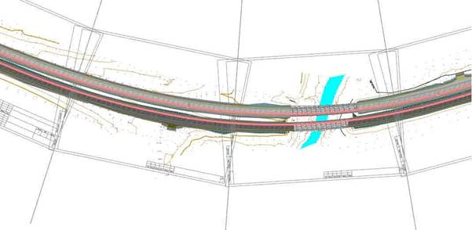
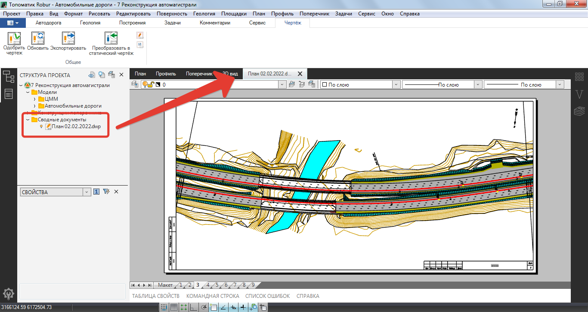
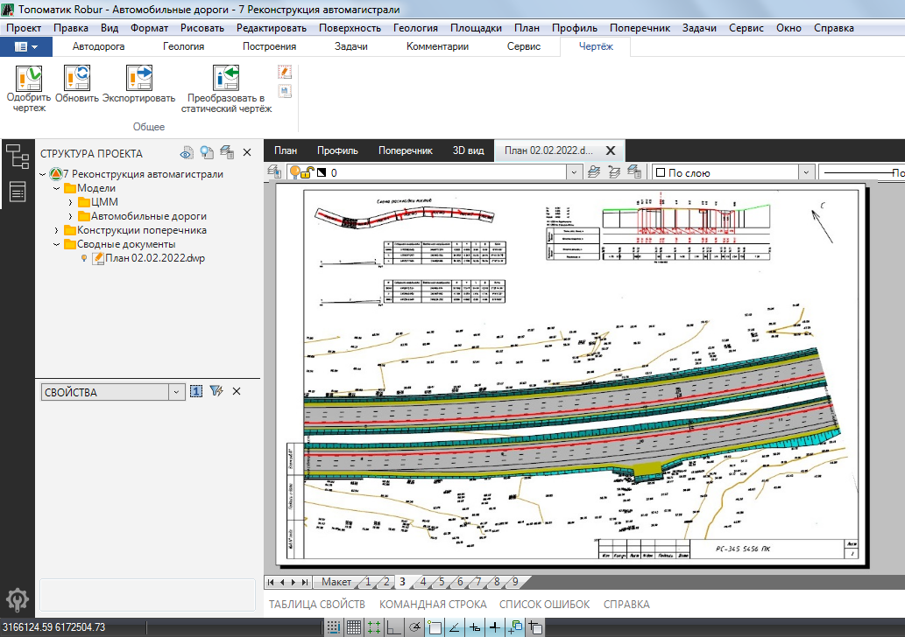
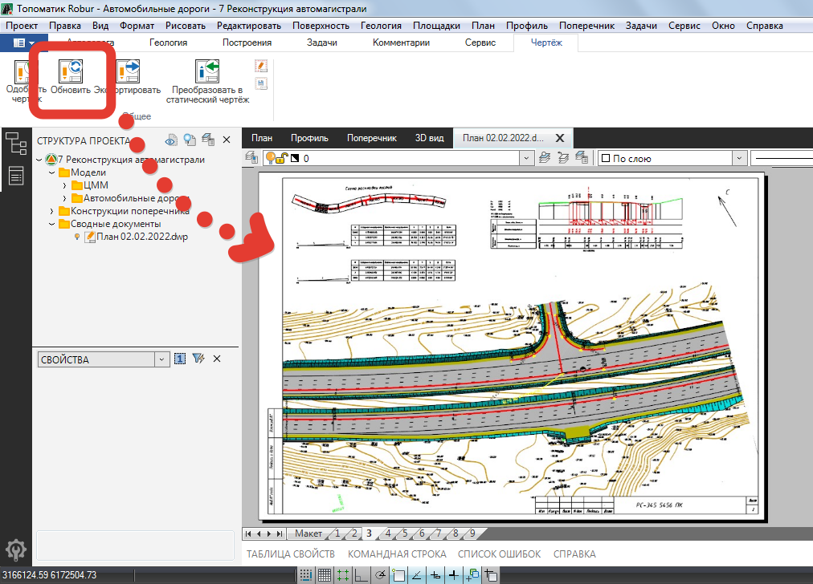

# Динамический чертеж

Данный функционал позволяет оптимизировать работы по оформлению чертежей в программном комплекте **{{robur}}**. В частности, имеющийся функционал позволяет выполнять оформительские задачи непосредственно в модели проекта, а также обновлять уже готовые чертежи при ее изменениях.

Для этого:

1. Предварительно с помощью любого доступного функционала из меню **Рисовать - Планшет** выполните раскладку листов:

   

2. В окне создания чертежа планшета (меню **Рисовать – Планшет – Сформировать планшет**) выберите формат файла **Чертеж Robur (\*.dwp)** и нажмите **ОК**:

   

3. В результате сформируется файл чертежа, который будет добавлен в соответствующую папку (**Сводные документы**) в **Структуре проекта**:

   

   

   Путь сохранения выходной документации задается в меню **Сервис - Настройка**, раздел **Выходная документация**.

   

 4. Для работы с чертежом в области **Листа** (компоновка содержимого на листе, подпись дополнительных элементов и т.д.) имеется различный функционал:

  * Для компоновки содержимого на **Листе** выберите меню **Редактировать – Видовой экран – Переместить**, указав исходную и точку назначения.
  * Для поворота выберите меню **Редактировать – Видовой экран – Повернуть**, указав визуально угол поворота.
  * Для перехода в **Модель** (окно **План**) из пространства Листа выберите меню **Редактировать – Видовой экран – Перейти в модель**:
    
    

5. При изменении модели чертежа (поменялась геометрия оси трассы, выполнили до оформление объектов топоплана и т.д.), чтобы внесенные изменения отобразились в области **Листа** необходимо либо нажать соответствующую кнопку на **Ленте**, либо в **Структуре проекта** щелкнуть правой кнопкой мыши на соответствующем чертеже и выбрать **Обновить**, В результате внесенные изменения в **Модели** отобразятся на **Листе**, причем внесенные ранее доработки в **Листе** сохранятся:

   



Общий функционал работы с выходной документацией подробно будет далее


