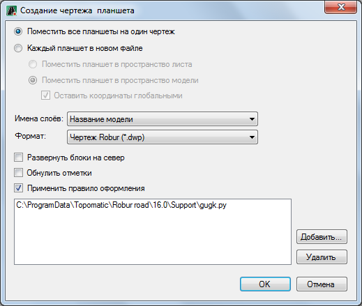

# Формирование чертежей планшетов

Функция позволяет формировать чертежи выбранных листов или планшетов.

Для этого:

1. Выберите меню **Рисовать – Планшет – Сформировать планшет**.

2. Курсор примет форму прицела, укажите необходимые листы или планшеты, для подтверждения выбора нажмите правую клавишу мыши или кнопку **Enter**. Откроется диалоговое окно:

   

   **Поместить все планшеты на один чертеж** – При выборе данной опции программа сформирует один файл, в котором будет находиться модель чертежа и набор сформированных листов.

   При выборе опции **Каждый планшет в новом файле**, станут доступны следующие варианты формирования чертежа:

   **Поместить планшет в пространство листа** – для каждого выбранного планшета программа сформирует свой файл, в котором будет находиться модель чертежа и сам лист.

   **Поместить планшет в пространство модели** - для каждого выбранного планшета программа сформирует свой файл чертежа, в котором планшет будет находиться в пространстве модели, а листа не будет.

   При выборе опции **Поместить планшет в пространство модели** станет доступной опция **Оставить координаты глобальными**, установка которой позволяет сформировать планшет в исходных координатах. При отключении данной опции, программа сформирует чертеж планшета в координатах **X0, Y0**.

   Выпадающий список **Имена слоев** позволяет выбрать один из вариантов формирования имен слоев чертежа:

  * **Полные** – имя слоя будет формироваться по следующему принципу - \Модели\Название модели\Имя слоя. Т.е. например, слой **Горизонтали** находящийся в модели поверхности **Eg** будет иметь следующее имя – **«Модели. ЦММ. Eg. Горизонтали»**.
  * **Название модели** – имя слоя будет формироваться по следующему принципу - \Название модели\Имя слоя. Т.е. например, слой **Горизонтали** находящийся в модели поверхности **Eg** будет иметь следующее имя – **«Eg.Горизонтали»**.
  * **Название слоя** - имя слоя будет формироваться по следующему принципу - \Имя слоя. Т.е. например слой **Горизонтали** находящийся в модели поверхности **Eg** и любой другой **ЦММ** будет иметь следующее имя – **«Горизонтали»**.

    В выпадающем списке **Формат** имеется возможность выбрать формат файла чертежа.

    Опция **Развернуть блоки на север** позволяет включать\выключать автоматический разворот условных знаков по нижней рамке листа. Т.е. при включении данной опции все\* условные знаки будут ориентированы на север.

    

    Те условные знаки в свойствах которых был задан угол поворота и установлен Флаг - Замороженная на север ориентированы не будут.

    

    При включении опции **Обнулить отметки** для всех элементов чертежа (блоки, текст, и т.д.) в их свойствах будет задана нулевая высотная отметка, а примитивы имеющие тип 3D полилинии будут преобразованы в 2D полилинии с нулевым высотным положением.

    Опция **Применить правило оформления** позволяет для формируемого чертежа применить определенный набор действий (скриптов), которые могут автоматически привести чертежи в соответствие с необходимыми требованиями. Например, в правиле оформления может быть заложено: преобразование примитива МТЕКСТ в ТЕКСТ, именование элементов чертежа (блоков, типов линий и т.д.) определенным образом, перемещение элементов чертежа на определенные именованные слои, задание элементам определенного цвета и т.д.

    

    Скрипт - это текстовый файл, написанный на языке программирования *python* с расширением \*py. Правила оформления располагаются в каталоге `C:\ProgramData\Topomatic\Robur Survey\16.0\Support`. В зависимости от используемой конфигурации программы путь может незначительно отличаться

    

    Имеющиеся в программе правила оформления:

  * **gugk.py** - скрипт, позволяющий формировать чертеж согласно требованиям, которые предъявляются при сдаче объектов в ГАУ «Леноблгосэкспертиза».
  * **green_gugk.py** - скрипт позволяющий формировать чертеж согласно требованиям "ГУГК Условные знаки для топографических планов масштабов 1:5000, 1:2000, 1:1000, 1:500".
  * **gray.py** - скрипт, позволяющий при формировании чертежей, все слои элементов топографического плана выводить серым цветом. Настройки цвета слоев для используемого скрипта задаются в одноименном xml-файле
  * **color.py** - скрипт, позволяющий при формировании чертежей, задавать определенный цвет всем слоям топографического плана, а всем элементам чертежа выставлять цвет - По слою. Настройки цвета слоев для используемого скрипта задаются в одноименном xml-файле

    

    На данный момент оформление топографических планов согласно требованиям "ГУГК Условные знаки для топографических планов масштабов 1:5000, 1:2000, 1:1000, 1:500" производится за счет функционала [Наборы условных знаков](../../../../annex/libraries/set_of_signs.md). Скрипт *green\_gugk.py* на данный момент оставлен для совместимости.

    

    Одновременно при формировании чертежа может использоваться одно или несколько правил.

    Для добавления или удаления правил используются соответствующие кнопки.

    

    При добавлении нескольких правил оформления, выполняться они будут по списку сверху вниз.

    

3. Установите необходимые опции создания чертежа и нажмите **ОК**.
