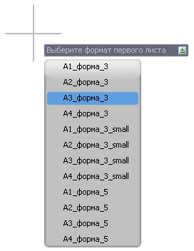
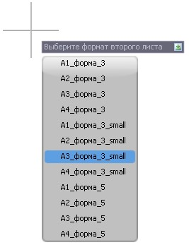
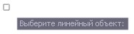
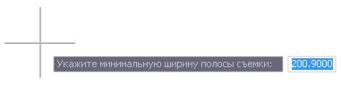
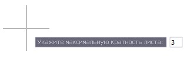
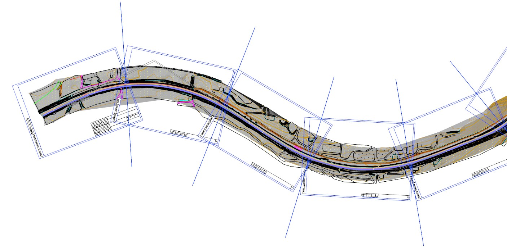
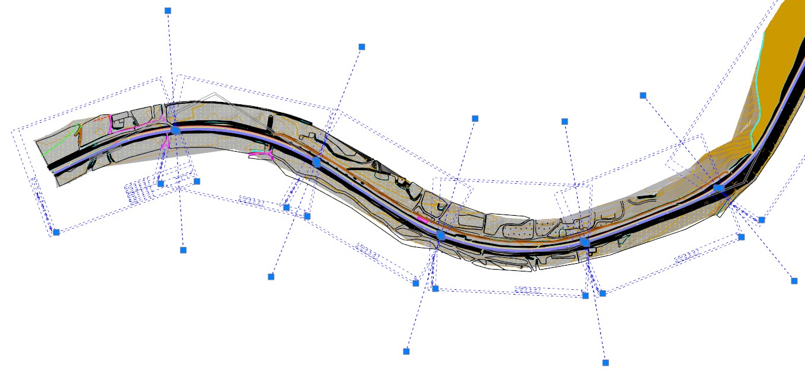
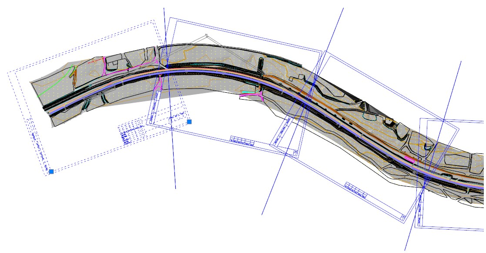

# Раскладка листов вдоль трассы

Данная функция позволяет произвести автоматическую раскладку листов необходимого формата вдоль заданной трассы. При раскладке листы объединяются в группу, что позволяет выполнять их дальнейшее редактирование как единого объекта.

Для этого:

1. Выберите меню **Рисовать – Планшет – Раскладка вдоль трассы**.

2. В открывшемся контекстном меню выберите требуемый формат первого и последующих листов:

    
   

3. Укажите линейный объект, вдоль которого будет произведена раскладка листов:

   

   

   В качестве **Линейного объекта** может выступать любой объект, например Трасса, Полилиния или Структурная линия

   

4. Задайте значение **Максимальной ширины съемки**.

   

   

   Данный параметр, задает минимальное расстояние от внутренней рамки листа до указанного линейного объекта вдоль которого производится раскладка. Т.е. чем меньше данное значение тем ближе может быть расположен лист (внутренняя рамка) к выбранному линейному объекту.

   

5. Левой кнопкой мыши укажите начало участка и конец участка раскладки, при необходимости раскладки планшетов на всем выбранном линейном объекте нажмите правой кнопкой мыши.

6. В случае наличия длинных прямых участков на выбранном линейном объекте укажите **Максимальную кратность листов**, чтобы на этих участках ограничить кратность вставляемых программой форматов (например **А4х3**):

   

В результате программа произведет раскладку листов вдоль выбранного линейного объекта:

## Редактирование группы листов

Для удобства редактирования, удаления, заполнения основной надписи разложенные листы вдоль линейного объекта объединены в группу:

Для того чтобы отредактировать (удалить, изменить параметры, переместить и т.д.) отдельные элементы раскладки (листы, линии совмещения и т.д.), необходимо производить выделение элемента раскладки с зажатой клавишей **Shift**:



Заполнение основной надписи производится на этапе формирования выходных данных, более подробно будет описано далее


