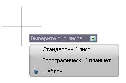
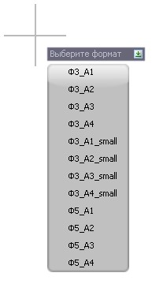

# Добавление листа

Для того чтобы добавить пользовательский лист:

1. Выберите меню **Рисовать – Планшет – Добавить лист**, программа предложит выбрать один из вариантов:

   

2. Выберите пункт **Шаблон**, откроется контекстное меню выбора имеющихся шаблонов листов:

   

   

   В данном выпадающем списке отображаются шаблоны листов которые расположены в каталоге `C:\ProgramData\Topomatic\Robur Survey\16.0\Support\Sht`. В зависимости от конфигурации программы путь может незначительно отличаться.

   

3. Левой кнопкой мыши укажите точку вставки листа в модель.
4. Перемещая курсор, задайте визуально направление вставляемого листа (угол поворота относительно горизонтальной оси), для подтверждения направления щелкните правой кнопкой мыши.
5. При необходимости, перемещая курсор в заданном направлении, увеличьте длину листа (кратность), для подтверждения выбранного размера щелкните правой кнопкой мыши.
