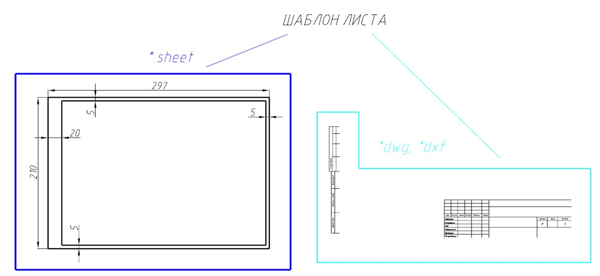
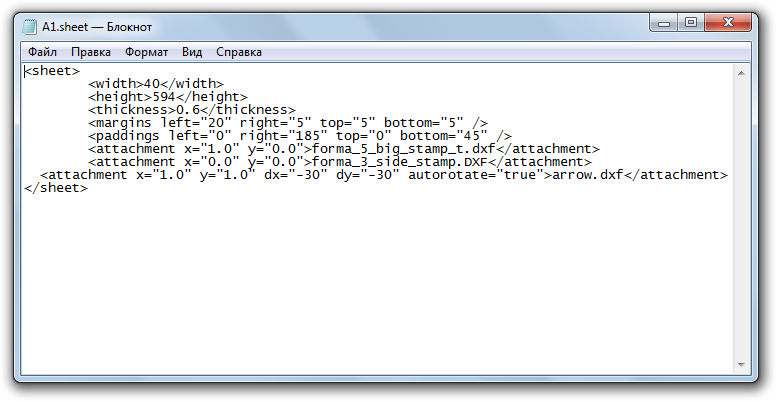
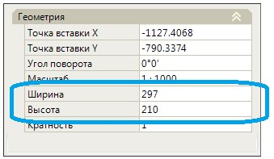
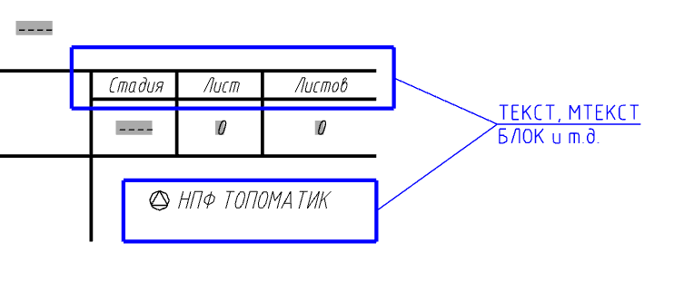

# Структура шаблона

В программе имеется возможность добавления и использования собственных листов произвольного **Вида** и **Формата**.



При необходимости использования листов кратности 2 и более, например А4х2, А4х3...А4хn, нет необходимости создавать отдельные шаблоны для этих размеров, так как кратность любого листа, в частности и добавленного пользователем может быть задана отдельной настройкой **Кратность** (в окне Свойства добавленного листа), либо при использовании некоторых функций, например **Раскладка вдоль трассы**, программа может автоматически увеличивать кратность выбранных листов.



Шаблон листа представляет собой текстовый файл с расширением **.sheet**, который содержит информацию о размере листа (формате), толщине рамки, отступах, а также содержит список дополнительных файлов (**чертежи в формате robur, dwg\dxf**) которые могут быть включены в состав данного шаблона, например в качестве основного или бокового штампов.

## Структура файла шаблона с расширением *.sheet

С помощью программы **Блокнот** или любого другого текстового редактора откройте файл с расширением ***.sheet**:



По умолчанию, для примера, несколько пользовательских шаблонов листов разных форматов хранятся в каталоге `C:\ProgramData\Topomatic\Robur Survey\16.0\Support\Sht`. Указанный путь может незначительно отличаться в зависимости от используемой конфигурации программы. Так же настоятельно НЕ рекомендуем хранить свои созданные шаблоны в данном каталоге, так как при удалении/переустановке программы **{{robur}}**, данные файлы будут удалены или перезаписаны. Рекомендуем хранить пользовательские шаблоны в папке **Support** которая находится в каталоге `C:\My documents\Топоматик Robur\Support`.



## Описание параметров

`<width>210</width>` - данный параметр определяет ширину листа по умолчанию.

`<height>297</height>` - данный параметр определяет высоту листа по умолчанию.



 Данные параметры **Ширины** и **Высоты** листа задают непосредственно значения по умолчанию, которые будут присвоены листу при его добавлении. Далее в окне **Свойств** созданного листа параметры формата можно при необходимости поменять:
 
 



`<thickness>0,6</thickness>` - данный параметр определяет толщину внутренней рамки листа.

`<margins left="20" right="5" top="5" bottom="5" />` - данный параметр определяет размеры отступов внутренней рамки слева, справа, сверху и снизу соответственно от границ листа.

`<paddings left="0" right="185" top="0" bottom="45" />` - данный параметр используется для определения расчетной области внутри листа в которой могут быть отрисованы элементы чертежа.

`<attachment x="1.0" y="0.0">название файла чертежа</attachment>` - данный параметр определяет положение (координаты) вставляемого файла чертежа в области листа и его имя.

`<attachment x="1.0" y="1.0" dx="-30" dy="-30" autorotate="true">arrow.dxf</attachment>` - для отрисовки на листе стрелки северного направления задается приращение *dx* и *dy* относительно заданных координат угла листа (по умолчанию *x="1.0"* *y="1.0"*), а также свойство *autorotate* позволяет задать автоматический поворот стрелки на север вне зависимости от того какой задан угол поворота самого листа.



1. Начало координат (x0, y0) в системе листа, является его левый нижний угол, правый нижний угол имеет координаты x1, y0, верхний правый угол x1, y1, а верхний левый угол x0, y1. Ниже приведена схема:

   

   Т.е. например координаты вставки чертежа основного штампа необходимо задать x=»1.0» y=»0.0», а координаты вставки чертежа бокового штампа x=»0.0» y=»0.0»

2. Подключаемый **dwp\dwg\dxf** файл чертежа должен храниться в том же каталоге что и файл шаблона с расширением **\*.sheet**.



## Структура файла чертежа с расширением \*dwp, \*dwg, \*.dxf

Имеется возможность вставить в шаблон листа файлы чертежей (dwp\dwg\dxf), которые могут содержать, например графы, текст, логотип организации и т.д., форму основного или бокового штампов.

Данные файлы могут быть созданы или отредактированы во встроенном редакторе чертежей или среде AutoCAD.

Чертеж основного штампа по умолчанию имеет вид:

Шаблон может состоять из любых примитивов чертежа (полилиний, отрезков, текста и т.д.).

Текстовые надписи в шаблоне могут быть выполнены с помощью примитива **Текст**, **МТекст** или **МТЕКСТ с полем**.

В случае если содержимое подписей в графах **Основной (боковой)** надписи не меняется, например это названия граф - **Стадия, Лист, Подпись, Дата, Логотип организации и т.д**., то в данном случае эти элементы могут быть выполнены с помощью примитивов **Текст**, **МТекст** или например **Блок**.

В случае если содержимое подписей в графах Основной (боковой) надписи меняется, например, в графах, где указывается - **Наименование объекта, Вид работ, Фамилии и Должности лиц и т.д.**, то они выполняются с помощью примитива **МТЕКСТ с полем** (подробное описание вставки пользовательского элемента **МТЕКСТ с полем** см. ниже).



Заполнение основной надписи производится на этапе формирования выходных данных, более подробно будет описано далее


