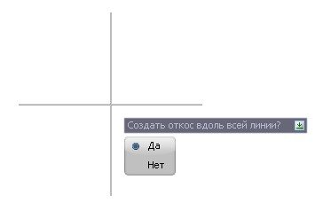
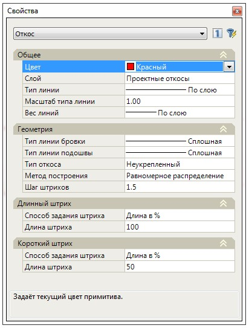

# Отрисовка, редактирование примитива Откос

Функционал программы позволяет вручную отрисовать условный знак **Откос**, указав линию бровки и подошвы, а также задавать различные параметры отображения условного знака.

## Отрисовка условного знака

Для отрисовки условного знака:

1. Выберите меню **Рисовать – Откос – Рисовать**, курсор примет форму прицела.
2. Последовательно, левой кнопкой мыши укажите линейный объект (полилиния, структурная линия, горизонталь, ось подобъекта и т.д.) **Бровки** и **Подошвы**, откроется дополнительный запрос:
   
   

3. Выберите **ДА**, если нужно создать откос вдоль всей линии или **НЕТ** если необходимо задать границы отрисовки условного знака.
4. В результате, между двумя указанными линиями будет отрисован условный знак **Откос**:

   

## Редактирование условного знака

Для редактирования и изменения различных параметров отрисовки условного знака:

1. Выделите условный знак левой кнопкой мыши, отобразятся вершины (грипы) с помощью которых можно редактировать геометрию условного знака:
   
   
   
   Квадратные грипы находящиеся на линиях **Бровки** и **Подошвы** позволяют изменить границы условного знака:

    **Грипы** в виде кружков позволяют изменить наклон штрихов условного знака, тем самым более правильно отрисовать условный знак на характерных участках рельефа:

   

1. Выберите меню **Рисовать – Откос – Разорвать** для разделения условного знака на несколько частей, визуально указав точку разрыва:

   

1. В окне **Свойств** можно изменить параметры условного знака:
   
   
