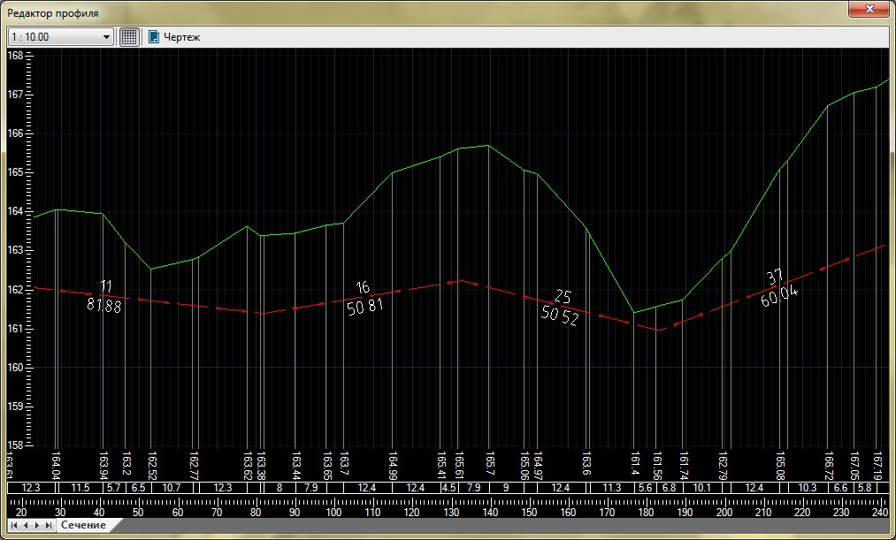
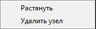
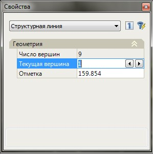

# Редактирование профиля сечения

Опция предназначена для детального редактирования профиля какого – либо линейного объекта, например – подземных коммуникаций. Также, имеется возможность создания чертежа сечения необходимого масштаба. Для этого:

1. Выберите левой кнопкой мыши линейный объект, профиль которого необходимо отредактировать.
2. Щелкните правой кнопкой мыши, в открывшемся контекстном меню выберите пункт- **Редактировать профиль сечения**, откроется диалоговое окно редактора сечения:

   

В данном окне **Редактора профиля** имеется возможность создавать, редактировать и удалять узлы профиля линейного объекта:

* Для того чтобы создать дополнительные узлы два раза щелкните левой кнопкой мыши на необходимом участке профиля.
* Для редактирования положения узлов:

  Выделите профиль и нажмите правой кнопкой мыши на нужном узле, откроется контекстное меню:

  

  Выберите **Растянуть**, для того чтобы отредактировать высотное положение узла. Выберите **Удалить узел** для удаления узла.



 Помимо коммуникаций, данная функция может аналогичным образом использоваться для редактирования отметок и уклонов ограничивающих структурных линий, с соответствующим автоматическим перестроением поверхности.



Для точного изменения отметки узла выделите профиль, в окне **Свойства** в поле **Текущая вершина** выберите нужную вершину и в поле **Отметка** задайте необходимое значение:

Для изменения отношения горизонтального масштаба к вертикальному, выберите нужное значение из соответствующего выпадающего списка  расположенного на панели инструментов.

Для создания чертежа нажмите на  расположенную на панели инструментов окна **Редактор профиля**.
